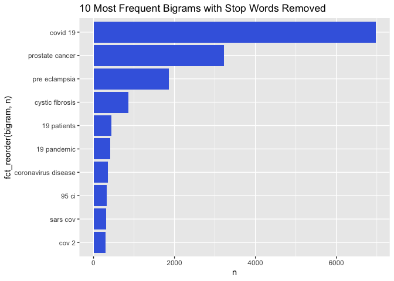

Assignment 3
================
Sylvia Baeyens
due 11/5/2021

# APIs

## 1. Using the NCBI API, look for papers that show up under the term “sars-cov-2 trial vaccine.” Look for the data in the pubmed database, and then retrieve the details of the paper as shown in lab 7. How many papers were you able to find?

``` r
website = xml2::read_html("https://pubmed.ncbi.nlm.nih.gov/?term=sars-cov-2+trial+vaccine")
count = xml2::xml_find_first(website, "/html/body/main/div[9]/div[2]/div[2]/div[1]/div[1]/span")
count = as.character(count)
numCount = stringr::str_extract(count, "[0-9,]+")
```

There are 2339 papers.

## 2. Using the list of pubmed ids you retrieved, download each papers’ details using the query parameter rettype = abstract. If you get more than 250 ids, just keep the first 250.

``` r
query_ids = GET(
  url   = "https://eutils.ncbi.nlm.nih.gov/entrez/eutils/esearch.fcgi",
  query = list(
    db = "pubmed",
    term = "sars-cov-2 trial vaccine",
    retmax = 1000
  )
)
ids = httr::content(query_ids)
ids = as.character(ids)
ids = stringr::str_extract_all(ids, "<Id>[[:digit:]]+</Id>")[[1]]
ids = stringr::str_remove_all(ids, "<Id>|</Id>")
ids = ids[1:250] #to keep only first 250
ids2 = I(paste(ids, collapse = ","))

pubs = GET(
  url   = "https://eutils.ncbi.nlm.nih.gov/entrez/eutils/efetch.fcgi",
  query = list(
    db =  "pubmed",
    id = ids2,
    retmax = 1000,
    rettype = "abstract"
    )
)

pubs = httr::content(pubs)
pubsText = as.character(pubs)
```

## 3. As we did in lab 7. Create a dataset containing the following: Pubmed ID number, Title of the paper,

Name of the journal where it was published, Publication date, and
Abstract of the paper (if any).

``` r
pub_char_list = xml2::xml_children(pubs)
pub_char_list = sapply(pub_char_list, as.character)
# Title of the Paper
title = str_extract(pub_char_list, "<ArticleTitle>[[:print:][:space:]]+</ArticleTitle>")
title = str_remove_all(title, "</?[[:alnum:]- =\"]+>")
# Name of Journal where it was Published
journal = str_extract(pub_char_list, "<Title>[[:print:][:space:]]+</Title>")
journal = str_remove_all(journal, "</?[[:alnum:]- =\"]+>")
journal = str_replace_all(journal, "[[:space:]]+", " ")
# Publication Date
PubDate = str_extract(pub_char_list, "<PubDate>[[:print:][:space:]]+</PubDate>")
PubDate = str_remove_all(PubDate, "</?[[:alnum:]- =\"]+>")
PubDate = str_replace_all(PubDate, "[[:space:]]+", " ")
# Abstract of the paper (if any)
abstracts = str_extract(pub_char_list, "<Abstract>[[:print:][:space:]]+</Abstract>")
abstracts = str_remove_all(abstracts, "</?[[:alnum:]- =\"]+>")
abstracts = str_replace_all(abstracts, "[[:space:]]+", " ")


# Create a database
database = data.frame(
  Journal = journal,
  PublicationDate = PubDate,
  PubMedID = ids,
  Title = title,
  Abstract = abstracts
)
knitr::kable(database[1:15, ], caption = "Summary of first Sars-2 Covid Vaccine Academic Papers")
```

| Journal                                                                                              | PublicationDate | PubMedID | Title                                                                                                                                                                              | Abstract                                                                                                                                                                                                                                                                                                                                                                                                                                                                                                                                                                                                                                                                                                                                                                                                                                                                                                                                                                                                                                                                                                                                                                                                                                                                                                                                                                                                                                                                                                                                                                                                                                                                                                                                                                                                                                                                                                                                                                                                                                                                                                                                                                                                                                                                                                                                                                                                                                                                                                          |
|:-----------------------------------------------------------------------------------------------------|:----------------|:---------|:-----------------------------------------------------------------------------------------------------------------------------------------------------------------------------------|:------------------------------------------------------------------------------------------------------------------------------------------------------------------------------------------------------------------------------------------------------------------------------------------------------------------------------------------------------------------------------------------------------------------------------------------------------------------------------------------------------------------------------------------------------------------------------------------------------------------------------------------------------------------------------------------------------------------------------------------------------------------------------------------------------------------------------------------------------------------------------------------------------------------------------------------------------------------------------------------------------------------------------------------------------------------------------------------------------------------------------------------------------------------------------------------------------------------------------------------------------------------------------------------------------------------------------------------------------------------------------------------------------------------------------------------------------------------------------------------------------------------------------------------------------------------------------------------------------------------------------------------------------------------------------------------------------------------------------------------------------------------------------------------------------------------------------------------------------------------------------------------------------------------------------------------------------------------------------------------------------------------------------------------------------------------------------------------------------------------------------------------------------------------------------------------------------------------------------------------------------------------------------------------------------------------------------------------------------------------------------------------------------------------------------------------------------------------------------------------------------------------|
| PloS one                                                                                             | 2021            | 34739520 | Is the BNT162b2 COVID-19 vaccine effective in elderly populations? Results from population data from Bavaria, Germany.                                                             | The efficacy of the BioNTech-Pfizer BNT162b2 vaccination in the elderly (≥80 years) could not be fully assessed in the BioNTech-Pfizer trial due to low numbers in this age group. We aimed to evaluate the effectiveness of the BioNTech-Pfizer (BNT162b2) vaccine to prevent SARS-CoV-2 infection and severe outcomes in octo- and novo-generians in a German state setting. A prospective observational study of 708,187 persons aged ≥80 years living in Bavaria, Germany, was conducted between Jan 9 to Apr 11, 2021. We assessed the vaccine effectiveness (VE) for two doses of the BNT162b2 vaccine with respect to SARS-CoV-2 infection and related hospitalisations and mortality. Additionally, differences in VE by age groups ≥80 to ≤89 years and ≥90 years were studied. Analyses were adjusted by sex. By the end of follow-up, 63.8% of the Bavarian population ≥80 years had received one dose, and 52.7% two doses, of the BNT162b2 vaccine. Two doses of the BNT162b2 vaccine lowered the proportion of SARS-CoV-2 infections and related outcomes, resulting in VE estimates of 68.3% (95% confidence interval (CI) 65.5%, 70.9%) for infection, 73.2% (95% CI 65.3%, 79.3%) for hospitalisation, and 85.1% (95% CI 80.0%, 89.0%) for mortality. Sex differences in the risk of COVID-19 outcomes observed among unvaccinated persons disappeared after two BNT162b2 vaccine doses. Overall, the BNT162b2 vaccine was equally effective in octo- and novo-genarians. Two doses of BioNTech-Pfizer’s BNT162b2 vaccine is highly effective against COVID-19 outcomes in elderly persons.                                                                                                                                                                                                                                                                                                                                                                                                                                                                                                                                                                                                                                                                                                                                                                                                                                                                                                      |
| Clinical infectious diseases : an official publication of the Infectious Diseases Society of America | 2021 Nov 05     | 34739037 | Evaluating the Neutralizing Ability of a CpG-Adjuvanted S-2P Subunit Vaccine Against Severe Acute Respiratory Syndrome Coronavirus 2 (SARS-CoV-2) Variants of Concern.             | Variants of concern (VoCs) have the potential to diminish the neutralizing capacity of antibodies elicited by vaccines. MVC-COV1901 is a severe acute respiratory syndrome coronavirus 2 (SARS-CoV-2) vaccine consisting of recombinant prefusion stabilized spike protein S-2P adjuvanted with CpG 1018 and aluminum hydroxide. We explored the effectiveness of MVC-COV1901 against the VoCs. Serum samples were taken from rats and phase 1 clinical trial human subjects immunized with a low, medium, or high dose of MVC-COV1901. The neutralizing titers of serum antibodies were assayed with pseudoviruses coated with the SARS-CoV-2 spike protein of the wild-type (WT), D614G, Alpha, or Beta variants. Rats vaccinated twice with vaccine containing high doses of antigen retained high levels of neutralization activity against the Beta variant, albeit with a slight reduction compared to WT. After the third dose, neutralizing titers against the Beta variant were noticeably enhanced regardless of the amount of antigen used for immunization. In humans, vaccinated phase 1 subjects still showed appreciable neutralization abilities against the D614G, Alpha, and Beta variants, although neutralizing titers were significantly reduced against the Beta variant. Two doses of MVC-COV1901 were able to elicit neutralizing antibodies against SARS-CoV-2 variants with an overall tendency of inducing higher immune response at a higher dose level. The neutralizing titers to the Beta variant in rats and humans were lower than those for WT and the Alpha variant. An additional third dose in rats was able to partially compensate for the reduction in neutralization against the Beta variant. We have demonstrated that immunization with MVC-COV1901 was effective against VoCs. © The Author(s) 2021. Published by Oxford University Press for the Infectious Diseases Society of America.                                                                                                                                                                                                                                                                                                                                                                                                                                                                                                                                                                            |
| Cell                                                                                                 | 2021 Oct 16     | 34735795 | Immunogenicity of standard and extended dosing intervals of BNT162b2 mRNA vaccine.                                                                                                 | Extension of the interval between vaccine doses for the BNT162b2 mRNA vaccine was introduced in the United Kingdom to accelerate population coverage with a single dose. At this time, trial data were lacking, and we addressed this in a study of United Kingdom healthcare workers. The first vaccine dose induced protection from infection from the circulating alpha (B.1.1.7) variant over several weeks. In a substudy of 589 individuals, we show that this single dose induces severe acute respiratory syndrome coronavirus 2 (SARS-CoV-2) neutralizing antibody (NAb) responses and a sustained B and T cell response to the spike protein. NAb levels were higher after the extended dosing interval (6-14 weeks) compared with the conventional 3- to 4-week regimen, accompanied by enrichment of CD4+ T cells expressing interleukin-2 (IL-2). Prior SARS-CoV-2 infection amplified and accelerated the response. These data on dynamic cellular and humoral responses indicate that extension of the dosing interval is an effective immunogenic protocol. Copyright © 2021 The Author(s). Published by Elsevier Inc. All rights reserved.                                                                                                                                                                                                                                                                                                                                                                                                                                                                                                                                                                                                                                                                                                                                                                                                                                                                                                                                                                                                                                                                                                                                                                                                                                                                                                                                                       |
| MMWR. Morbidity and mortality weekly report                                                          | 2021 Nov 05     | 34735426 | Effectiveness of 2-Dose Vaccination with mRNA COVID-19 Vaccines Against COVID-19-Associated Hospitalizations Among Immunocompromised Adults - Nine States, January-September 2021. | Immunocompromised persons, defined as those with suppressed humoral or cellular immunity resulting from health conditions or medications, account for approximately 3% of the U.S. adult population (1). Immunocompromised adults are at increased risk for severe COVID-19 outcomes (2) and might not acquire the same level of protection from COVID-19 mRNA vaccines as do immunocompetent adults (3,4). To evaluate vaccine effectiveness (VE) among immunocompromised adults, data from the VISION Network\* on hospitalizations among persons aged ≥18 years with COVID-19-like illness from 187 hospitals in nine states during January 17-September 5, 2021 were analyzed. Using selected discharge diagnoses,† VE against COVID-19-associated hospitalization conferred by completing a 2-dose series of an mRNA COVID-19 vaccine ≥14 days before the index hospitalization date§ (i.e., being fully vaccinated) was evaluated using a test-negative design comparing 20,101 immunocompromised adults (10,564 \[53%\] of whom were fully vaccinated) and 69,116 immunocompetent adults (29,456 \[43%\] of whom were fully vaccinated). VE of 2 doses of mRNA COVID-19 vaccine against COVID-19-associated hospitalization was lower among immunocompromised patients (77%; 95% confidence interval \[CI\] = 74%-80%) than among immunocompetent patients (90%; 95% CI = 89%-91%). This difference persisted irrespective of mRNA vaccine product, age group, and timing of hospitalization relative to SARS-CoV-2 (the virus that causes COVID-19) B.1.617.2 (Delta) variant predominance in the state of hospitalization. VE varied across immunocompromising condition subgroups, ranging from 59% (organ or stem cell transplant recipients) to 81% (persons with a rheumatologic or inflammatory disorder). Immunocompromised persons benefit from mRNA COVID-19 vaccination but are less protected from severe COVID-19 outcomes than are immunocompetent persons, and VE varies among immunocompromised subgroups. Immunocompromised persons receiving mRNA COVID-19 vaccines should receive 3 doses and a booster, consistent with CDC recommendations (5), practice nonpharmaceutical interventions, and, if infected, be monitored closely and considered early for proven therapies that can prevent severe outcomes.                                                                                                                                                                          |
| Toxicological sciences : an official journal of the Society of Toxicology                            | 2021 Nov 04     | 34735018 | COVID-19 Therapeutics and Vaccines: A Race to save Lives.                                                                                                                          | COVID-19 (Coronavirus Disease 2019), the disease caused by SARS-CoV-2 (Severe Acute Respiratory Syndrome Coronavirus-2) is an ongoing global public health emergency. As understanding of the health effects of COVID-19 have improved, companies and agencies worldwide have worked together to identify therapeutic approaches, fast-track clinical trials and pathways for emergency use, and approve therapies for patients. This work has resulted in therapies that not only improve survival, reduce time of hospitalization and time to recovery, but also include preventative measures, such as vaccines. This manuscript discusses development programs for three products that are approved or authorized for emergency use at the time of writing: VEKLURY (remdesivir, direct acting antiviral from Gilead Sciences, Inc.), REGEN-COV (casirivimab and imdevimab antibody cocktail from Regeneron Pharmaceuticals Inc.) and Comirnaty (Pfizer-BioNTech COVID-19 Vaccine \[Pfizer, Inc.-BioNTech\]), and perspectives from the US Food and Drug Administration (FDA). Published by Oxford University Press 2021.                                                                                                                                                                                                                                                                                                                                                                                                                                                                                                                                                                                                                                                                                                                                                                                                                                                                                                                                                                                                                                                                                                                                                                                                                                                                                                                                                                                     |
| The Lancet regional health. Europe                                                                   | 2021 Oct 28     | 34729549 | Adverse events of active and placebo groups in SARS-CoV-2 vaccine randomized trials: A systematic review.                                                                          | For safety assessment in clinical trials, adverse events (AEs) are reported for the drug under evaluation and compared with AEs in the placebo group. Little is known about the nature of the AEs associated with clinical trials of SARS-CoV-2 vaccines and the extent to which these can be traced to nocebo effects, where negative treatment-related expectations favor their occurrence. In our systematic review, we compared the rates of solicited AEs in the active and placebo groups of SARS-CoV-2 vaccines approved by the Western pharmaceutical regulatory agencies.We implemented a search strategy to identify trial-III studies of SARS-CoV-2 vaccines through the PubMed database. We adopted the PRISMA Statement to perform the study selection and the data collection and identified three trial: two mRNA-based (37590 participants) and one adenovirus type (6736 participants). Relative risks showed that the occurrence of AEs reported in the vaccine groups was higher compared with the placebo groups. The most frequently AEs in both groups were fatigue, headache, local pain, as injection site reactions, and myalgia. In particular, for first doses in placebo recipients, fatigue was reported in 29% and 27% in BNT162b2 and mRNA-1273 groups, respectively, and in 21% of Ad26.COV2.S participants. Headache was reported in 27% in both mRNA groups and in 24% of Ad26.COV2.S recipients. Myalgia was reported in 10% and 14% in mRNA groups (BNT162b2 and mRNA-1273, respectively) and in 13% of Ad26.COV2.S participants. Local pain was reported in 12% and 17% in mRNA groups (BNT162b2 and mRNA-1273, respectively), and in 17% of Ad26.COV2.S recipients. These AEs are more common in the younger population and in the first dose of placebo recipients of the mRNA vaccines. Our results are in agreement with the expectancy theory of nocebo effects and suggest that the AEs associated with COVID-19 vaccines may be related to the nocebo effect. Fondazione CRT - Cassa di Risparmio di Torino, IT (grant number 66346, “GAIA-MENTE” 2019). © 2021 The Authors.                                                                                                                                                                                                                                                                                                                                                                                          |
| JAMA network open                                                                                    | 2021 11 01      | 34726743 | Analysis of the Effectiveness of the Ad26.COV2.S Adenoviral Vector Vaccine for Preventing COVID-19.                                                                                | Continuous assessment of the effectiveness and safety of the US Food and Drug Administration-authorized SARS-CoV-2 vaccines is critical to amplify transparency, build public trust, and ultimately improve overall health outcomes. To evaluate the effectiveness of the Johnson & Johnson Ad26.COV2.S vaccine for preventing SARS-CoV-2 infection. <AbstractText Label="Design, Setting, and Participants">This comparative effectiveness research study used large-scale longitudinal curation of electronic health records from the multistate Mayo Clinic Health System (Minnesota, Arizona, Florida, Wisconsin, and Iowa) to identify vaccinated and unvaccinated adults between February 27 and July 22, 2021. The unvaccinated cohort was matched on a propensity score derived from age, sex, zip code, race, ethnicity, and previous number of SARS-CoV-2 polymerase chain reaction tests. The final study cohort consisted of 8889 patients in the vaccinated group and 88 898 unvaccinated matched patients. Single dose of the Ad26.COV2.S vaccine. The incidence rate ratio of SARS-CoV-2 infection in the vaccinated vs unvaccinated control cohorts, measured by SARS-CoV-2 polymerase chain reaction testing. The study was composed of 8889 vaccinated patients (4491 men \[50.5%\]; mean \[SD\] age, 52.4 \[16.9\] years) and 88 898 unvaccinated patients (44 748 men \[50.3%\]; mean \[SD\] age, 51.7 \[16.7\] years). The incidence rate ratio of SARS-CoV-2 infection in the vaccinated vs unvaccinated control cohorts was 0.26 (95% CI, 0.20-0.34) (60 of 8889 vaccinated patients vs 2236 of 88 898 unvaccinated individuals), which corresponds to an effectiveness of 73.6% (95% CI, 65.9%-79.9%) and a 3.73-fold reduction in SARS-CoV-2 infections. This study’s findings are consistent with the clinical trial-reported efficacy of Ad26.COV2.S and the first retrospective analysis, suggesting that the vaccine is effective at reducing SARS-CoV-2 infection, even with the spread of variants such as Alpha or Delta that were not present in the original studies, and reaffirm the urgent need to continue mass vaccination efforts globally.                                                                                                                                                                                                                                                                                                                               |
| Israel journal of health policy research                                                             | 2021 10 29      | 34715931 | Lessons from Israel’s COVID-19 Green Pass program.                                                                                                                                 | As of the beginning of March 2021, Israeli law requires the presentation of a Green Pass as a precondition for entering certain businesses and public spheres. Entitlement for a Green Pass is granted to Israelis who have been vaccinated with two doses of COVID-19 vaccine, who have recovered from COVID-19, or who are participating in a clinical trial for vaccine development in Israel. The Green Pass is essential for retaining immune individuals’ freedom of movement and for promoting the public interest in reopening the economic, educational, and cultural spheres of activity. Nonetheless, and as the Green Pass imposes restrictions on the movement of individuals who had not been vaccinated or who had not recovered, it is not consonant with solidarity and trust building. Implementing the Green Pass provision while advancing its effectiveness on the one hand, and safeguarding equality, proportionality, and fairness on the other hand may imbue this measure with ethical legitimacy despite involving a potential breach of trust and solidarity. © 2021. The Author(s).                                                                                                                                                                                                                                                                                                                                                                                                                                                                                                                                                                                                                                                                                                                                                                                                                                                                                                                                                                                                                                                                                                                                                                                                                                                                                                                                                                                                  |
| Journal of medical virology                                                                          | 2021 Oct 29     | 34713912 | Vaccine development and technology for SARS-CoV-2: current insights.                                                                                                               | SARS-CoV-2 is associated to a severe respiratory disease in China, that rapidly spread across continents. Since the beginning of the pandemic, available data suggested the asymptomatic transmission and patients were treated with specific drugs with efficacy and safety data not always satisfactory. The aim of this review is to describe the vaccines developed by three companies, Pfizer-BioNTech, Moderna and University of Oxford/AstraZeneca, in terms of both technological and pharmaceutical formulation, safety, efficacy and immunogenicity. A critical analysis of phase 1, 2 and 3 clinical trial results available was conducted, comparing the three vaccine candidates, underlining their similarities and differences. All candidates showed consistent efficacy and tolerability; although some differences can be noted, such as their technological formulation, temperature storage, which will be related to logistics and costs. Further studies will be necessary to evaluate long-term effects and to assess the vaccine safety and efficacy in the general population. This article is protected by copyright. All rights reserved. This article is protected by copyright. All rights reserved.                                                                                                                                                                                                                                                                                                                                                                                                                                                                                                                                                                                                                                                                                                                                                                                                                                                                                                                                                                                                                                                                                                                                                                                                                                                                                 |
| BMJ open                                                                                             | 2021 10 28      | 34711598 | BCG vaccination to reduce the impact of COVID-19 in healthcare workers: Protocol for a randomised controlled trial (BRACE trial).                                                  | BCG vaccination modulates immune responses to unrelated pathogens. This off-target effect could reduce the impact of emerging pathogens. As a readily available, inexpensive intervention that has a well-established safety profile, BCG is a good candidate for protecting healthcare workers (HCWs) and other vulnerable groups against COVID-19. This international multicentre phase III randomised controlled trial aims to determine if BCG vaccination reduces the incidence of symptomatic and severe COVID-19 at 6 months (co-primary outcomes) compared with no BCG vaccination. We plan to randomise 10 078 HCWs from Australia, The Netherlands, Spain, the UK and Brazil in a 1:1 ratio to BCG vaccination or no BCG (control group). The participants will be followed for 1 year with questionnaires and collection of blood samples. For any episode of illness, clinical details will be collected daily, and the participant will be tested for SARS-CoV-2 infection. The secondary objectives are to determine if BCG vaccination reduces the rate, incidence, and severity of any febrile or respiratory illness (including SARS-CoV-2), as well as work absenteeism. The safety of BCG vaccination in HCWs will also be evaluated. Immunological analyses will assess changes in the immune system following vaccination, and identify factors associated with susceptibility to or protection against SARS-CoV-2 and other infections. Ethical and governance approval will be obtained from participating sites. Results will be published in peer-reviewed open-access journals. The final cleaned and locked database will be deposited in a data sharing repository archiving system. ClinicalTrials.gov NCT04327206. © Author(s) (or their employer(s)) 2021. Re-use permitted under CC BY. Published by BMJ.                                                                                                                                                                                                                                                                                                                                                                                                                                                                                                                                                                                                                                                                         |
| Frontiers in immunology                                                                              | 2021            | 34707602 | Efficacy, Immunogenicity and Safety of COVID-19 Vaccines: A Systematic Review and Meta-Analysis.                                                                                   | There is a significant research gap in meta-analysis on the efficacy and safety of coronavirus disease 2019 (COVID-19) vaccines. This study analyzed the efficacy of COVID-19 vaccines. Published phase I, phase II, and phase III trials analyzing safety and immunogenicity and phase III randomized clinical trials evaluating the efficacy of COVID-19 vaccines were included. We searched MEDLINE, Scopus, and The Lancet for published articles evaluating the relative reduction in COVID-19 risk after vaccination. Selected literatures were published between December 15, 2019 and May 15, 2021 on the safety, efficacy, and immunogenicity of COVID-19 vaccines. This meta-analysis included studies that confirmed cases of COVID-19 using reverse transcriptase polymerase chain reaction. This study detected 8,926 eligible research articles published on COVID-19 vaccines. Of these, 25 studies fulfilled the inclusion criteria. Among the selected articles, 19 randomized clinical trials, 2 non-randomized clinical trials, and 3 observational studies were analyzed. Seven (28%) studies were included in the meta-analysis. The efficacy of the adenovirus vector vaccine was 73% (95% CI = 69-77) and that of the messenger RNA (mRNA) vaccine was 85% (95% CI = 82-88) in participants aged ≥18 years. There are no reports of clinical trials in participants aged under 16 years. The production of neutralizing antibodies against receptor-binding domains (RBDs) of severe acute respiratory syndrome coronavirus 2 (SARS-CoV-2) in &gt;90% of the vaccinated samples was reported within 0-30 days of the first or the second dose of the vaccine. Pain at the injection site was the most common local symptom in people receiving mRNA vaccines (29%-85% of participants). Fever (0.2%-95%) was the most prevalent in people receiving adenovirus vector vaccines, and fatigue (8.4%-55%) was the most common side effect in people receiving the mRNA vaccines. Studies suggest that mRNA vaccines and adenovirus vector vaccines can provide moderate to high protection against COVID-19 infection in people over 18 years. Evidence of the long-term protection of the vaccines in people aged under 16 years against the multiple variants of COVID-19 are limited. This study will provide an integrated evaluation on the efficacy, safety, and immunogenicity of the COVID-19 vaccines. Copyright © 2021 Sharif, Alzahrani, Ahmed and Dey.                            |
| Journal of general internal medicine                                                                 | 2021 Oct 26     | 34704204 | COVID-19 Testing and Vaccine Acceptability Among Homeless-Experienced Adults: Qualitative Data from Two Samples.                                                                   | Homeless-experienced populations are at increased risk of exposure to SARS-CoV-2 due to their living environments and face an increased risk of severe COVID-19 disease due to underlying health conditions. Little is known about COVID-19 testing and vaccination acceptability among homeless-experienced populations. To understand the facilitators and barriers to COVID-19 testing and vaccine acceptability among homeless-experienced adults. We conducted in-depth interviews with participants from July to October 2020. We purposively recruited participants from (1) a longitudinal cohort of homeless-experienced older adults in Oakland, CA (n=37) and (2) a convenience sample of people (n=57) during a mobile outreach COVID-19 testing event in San Francisco. Adults with current or past experience of homelessness. We asked participants about their experiences with and attitudes towards COVID-19 testing and their perceptions of COVID-19 vaccinations. We used participant observation techniques to document the interactions between testing teams and those approached for testing. We audio-recorded, transcribed, and content analyzed all interviews and identified major themes and subthemes. Participants found incentivized COVID-19 testing administered in unsheltered settings and supported by community health outreach workers (CHOWs) to be acceptable. The majority of participants expressed a positive inclination toward vaccine acceptability, citing a desire to return to routine life and civic responsibility. Those who expressed hesitancy cited a desire to see trial data, concerns that vaccines included infectious materials, and mistrust of the government. Participants expressed positive evaluations of the incentivized, mobile COVID-19 testing supported by CHOWs in unsheltered settings. The majority of participants expressed a positive inclination toward vaccination. Vaccine hesitancy concerns must be addressed when designing vaccine delivery strategies that overcome access challenges. Based on the successful implementation of COVID-19 testing, we recommend mobile delivery of vaccines using trusted CHOWs to address concerns and facilitate wider access to and uptake of the COVID vaccine. © 2021. Society of General Internal Medicine.                                                                                                                                                                         |
| Cureus                                                                                               | 2021 Sep        | 34703690 | A Rare Variant of Guillain-Barre Syndrome Following Ad26.COV2.S Vaccination.                                                                                                       | Efforts to combat the global pandemic caused by severe acute respiratory syndrome coronavirus 2 (SARS-CoV-2) range from adequate diagnostic testing and contract tracing to vaccination for the prevention of coronavirus disease 2019 (COVID-19). In the United States alone, three vaccinations have been authorized for emergency use (EUA) or approved to prevent COVID-19. The Ad26.COV2.S vaccine by Johnson and Johnson (New Brunswick, New Jersey) is the only adenovirus-based vaccine and deemed relatively effective and safe by the US Food and Drug Administration (FDA) following its clinical trial. Since its introduction, the US FDA has placed a warning on the vaccine adverse event reporting system (VAERS) after more than 100 cases of Guillain-Barre Syndrome (GBS) were reported. Herein, we outline the hospital course of a generally healthy 49-year-old female who experienced an axonal form of GBS nine days after receiving the Ad26.COV2.S vaccine. Copyright © 2021, Morehouse et al.                                                                                                                                                                                                                                                                                                                                                                                                                                                                                                                                                                                                                                                                                                                                                                                                                                                                                                                                                                                                                                                                                                                                                                                                                                                                                                                                                                                                                                                                                          |
| Journal for immunotherapy of cancer                                                                  | 2021 10         | 34702753 | Humoral immunogenicity of the seasonal influenza vaccine before and after CAR-T-cell therapy: a prospective observational study.                                                   | Recipients of chimeric antigen receptor-modified T (CAR-T) cell therapies for B cell malignancies have profound and prolonged immunodeficiencies and are at risk for serious infections, including respiratory virus infections. Vaccination may be important for infection prevention, but there are limited data on vaccine immunogenicity in this population. We conducted a prospective observational study of the humoral immunogenicity of commercially available 2019-2020 inactivated influenza vaccines in adults immediately prior to or while in durable remission after CD19-, CD20-, or B cell maturation antigen-targeted CAR-T-cell therapy, as well as controls. We tested for antibodies to all four vaccine strains using neutralization and hemagglutination inhibition (HAI) assays. Antibody responses were defined as at least fourfold titer increases from baseline. Seroprotection was defined as a HAI titer ≥40. Enrolled CAR-T-cell recipients were vaccinated 14-29 days prior to (n=5) or 13-57 months following therapy (n=13), and the majority had hypogammaglobulinemia and cellular immunodeficiencies prevaccination. Eight non-immunocompromised adults served as controls. Antibody responses to ≥1 vaccine strain occurred in 2 (40%) individuals before CAR-T-cell therapy and in 4 (31%) individuals vaccinated after CAR-T-cell therapy. An additional 1 (20%) and 6 (46%) individuals had at least twofold increases, respectively. One individual vaccinated prior to CAR-T-cell therapy maintained a response for &gt;3 months following therapy. Across all tested vaccine strains, seroprotection was less frequent in CAR-T-cell recipients than in controls. There was evidence of immunogenicity even among individuals with low immunoglobulin, CD19+ B cell, and CD4+ T-cell counts. These data support consideration for vaccination before and after CAR-T-cell therapy for influenza and other relevant pathogens such as SARS-CoV-2, irrespective of hypogammaglobulinemia or B cell aplasia. However, relatively impaired humoral vaccine immunogenicity indicates the need for additional infection-prevention strategies. Larger studies are needed to refine our understanding of potential correlates of vaccine immunogenicity, and durability of immune responses, in CAR-T-cell therapy recipients. © Author(s) (or their employer(s)) 2021. Re-use permitted under CC BY-NC. No commercial re-use. See rights and permissions. Published by BMJ. |
| Clinical infectious diseases : an official publication of the Infectious Diseases Society of America | 2021 Oct 26     | 34698827 | Measuring vaccine efficacy against infection and disease in clinical trials: sources and magnitude of bias in COVID-19 vaccine efficacy estimates.                                 | Phase III trials have estimated COVID-19 vaccine efficacy (VE) against symptomatic and asymptomatic infection. We explore the direction and magnitude of potential biases in these estimates and their implications for vaccine protection against infection and against disease in breakthrough infections. We developed a mathematical model that accounts for natural and vaccine-induced immunity, changes in serostatus and imperfect sensitivity and specificity of tests for infection and antibodies. We estimated expected biases in VE against symptomatic, asymptomatic and any SARS͏CoV2 infections and against disease following infection for a range of vaccine characteristics and measurement approaches, and the likely overall biases for published trial results that included asymptomatic infections. VE against asymptomatic infection measured by PCR or serology is expected to be low or negative for vaccines that prevent disease but not infection. VE against any infection is overestimated when asymptomatic infections are less likely to be detected than symptomatic infections and the vaccine protects against symptom development. A competing bias towards underestimation arises for estimates based on tests with imperfect specificity, especially when testing is performed frequently. Our model indicates considerable uncertainty in Oxford-AstraZeneca ChAdOx1 and Janssen Ad26.COV2.S VE against any infection, with slightly higher than published, bias-adjusted values of 59.0% (95% uncertainty interval \[UI\] 38.4 to 77.1) and 70.9% (95% UI 49.8 to 80.7) respectively. Multiple biases are likely to influence COVID-19 VE estimates, potentially explaining the observed difference between ChAdOx1 and Ad26.COV2.S vaccines. These biases should be considered when interpreting both efficacy and effectiveness study results. © The Author(s) 2021. Published by Oxford University Press for the Infectious Diseases Society of America.                                                                                                                                                                                                                                                                                                                                                                                                                                                                                                              |

Summary of first Sars-2 Covid Vaccine Academic Papers

# Text Mining

``` r
if (!file.exists("pubmed.csv")) {
download.file("https://raw.githubusercontent.com/USCbiostats/data-science-data/master/03_pubmed/pubmed.csv",
              destfile = "pubmed.csv", 
              method="libcurl", 
              timeout = 60
              )
}
pubmedData = data.table::fread("pubmed.csv")
```

## Tokenize the abstracts and count the number of each token. Do you see anything interesting? Does removing stop words change what tokens appear as the most frequent? What are the 5 most common tokens for each search term after removing stopwords?

``` r
pubmedData %>%
  unnest_tokens(token, abstract) %>%
  count(token, sort = TRUE) %>%
  top_n(15, n)%>%
  knitr::kable(caption = "15 Most Frequent Token Words without removing Stop Words")
```

| token    |     n |
|:---------|------:|
| the      | 28126 |
| of       | 24760 |
| and      | 19993 |
| in       | 14653 |
| to       | 10920 |
| a        |  8245 |
| with     |  8038 |
| covid    |  7275 |
| 19       |  7080 |
| is       |  5649 |
| for      |  5492 |
| patients |  4674 |
| cancer   |  3999 |
| prostate |  3832 |
| was      |  3315 |

15 Most Frequent Token Words without removing Stop Words

The 10 most frequent tokens are all stop words, with the exception of
covid and 19, as is to be expected. As we go further down the list to
11-15, we see more medically relevant words such as patient and cancer.

``` r
pubmedData %>%
  unnest_tokens(token, abstract) %>%
  anti_join(stop_words, by = c("token" = "word")) %>%
  count(token, sort = TRUE) %>%
  top_n(15, n)%>%
  knitr::kable(caption = "15 Most Frequent Token Words with Stop Words Removed")
```

| token        |    n |
|:-------------|-----:|
| covid        | 7275 |
| 19           | 7080 |
| patients     | 4674 |
| cancer       | 3999 |
| prostate     | 3832 |
| disease      | 2574 |
| pre          | 2165 |
| eclampsia    | 2005 |
| preeclampsia | 1863 |
| treatment    | 1841 |
| clinical     | 1682 |
| risk         | 1588 |
| women        | 1327 |
| study        | 1299 |
| results      | 1281 |

15 Most Frequent Token Words with Stop Words Removed

Now all the token words have medical relevance. The 5 most common are
covid, 19, patients, cancer, and prostate.

``` r
pubmedData %>% 
  unnest_tokens(token, abstract)%>%
  anti_join(stop_words,by = c("token" = "word"))%>%
  group_by(term)%>%
  count(token)%>%
  top_n(5,n)%>%
  knitr::kable(caption="5 Most Frequent Tokens Per Search Term")
```

| term            | token        |    n |
|:----------------|:-------------|-----:|
| covid           | 19           | 7035 |
| covid           | covid        | 7275 |
| covid           | disease      |  943 |
| covid           | pandemic     |  800 |
| covid           | patients     | 2293 |
| cystic fibrosis | cf           |  625 |
| cystic fibrosis | cystic       |  862 |
| cystic fibrosis | disease      |  400 |
| cystic fibrosis | fibrosis     |  867 |
| cystic fibrosis | patients     |  586 |
| meningitis      | clinical     |  187 |
| meningitis      | csf          |  206 |
| meningitis      | meningeal    |  219 |
| meningitis      | meningitis   |  429 |
| meningitis      | patients     |  446 |
| preeclampsia    | eclampsia    | 2005 |
| preeclampsia    | pre          | 2038 |
| preeclampsia    | preeclampsia | 1863 |
| preeclampsia    | pregnancy    |  969 |
| preeclampsia    | women        | 1196 |
| prostate cancer | cancer       | 3840 |
| prostate cancer | disease      |  652 |
| prostate cancer | patients     |  934 |
| prostate cancer | prostate     | 3832 |
| prostate cancer | treatment    |  926 |

5 Most Frequent Tokens Per Search Term

Here we see that the different search terms were covid, cystic fibrosis,
meningitis, preeclampsia, and prostate cancer. This table details the 5
most frequent token for each search term. There is some overlap between
search terms.

## Tokenize the abstracts into bigrams. Find the 10 most common bigram and visualize them with ggplot2.

``` r
pubmedData %>%
  unnest_ngrams(output = bigram, input = abstract, n = 2) %>%
  separate(bigram, into = c("word1", "word2"), sep = " ") %>%
  anti_join(stop_words, by = c("word1" = "word")) %>%
  anti_join(stop_words, by = c("word2" = "word")) %>%
  unite(bigram, c("word1", "word2"), sep = " ") %>%
  count(bigram, sort = TRUE) %>%
  top_n(10)%>%
  ggplot(aes(x = n, y = fct_reorder(bigram, n))) +
  geom_col(fill= "royal blue") +
  labs(title = "10 Most Frequent Bigrams with Stop Words Removed")
```

    ## Selecting by n

<!-- --> This plot shows
all the most frequent bigrams. They are all medically related.

## Calculate the TF-IDF value for each word-search term combination. (here you want the search term to be the “document”) What are the 5 tokens from each search term with the highest TF-IDF value? How are the results different from the answers you got in question 1?

``` r
pubmedData %>%
  unnest_tokens(word, abstract) %>%
  count(word, term) %>%
  bind_tf_idf(word, term, n) %>%
  group_by(term)%>%
  top_n(5,tf_idf)%>%
  arrange(desc(tf_idf), .by_group = TRUE)%>%
  knitr::kable(caption="5 Tokens with the highest TF-IDF values for each search term ")
```

| word            | term            |    n |        tf |       idf |   tf\_idf |
|:----------------|:----------------|-----:|----------:|----------:|----------:|
| covid           | covid           | 7275 | 0.0371050 | 1.6094379 | 0.0597183 |
| pandemic        | covid           |  800 | 0.0040803 | 1.6094379 | 0.0065670 |
| coronavirus     | covid           |  647 | 0.0032999 | 1.6094379 | 0.0053110 |
| sars            | covid           |  372 | 0.0018973 | 1.6094379 | 0.0030536 |
| cov             | covid           |  334 | 0.0017035 | 1.6094379 | 0.0027417 |
| cf              | cystic fibrosis |  625 | 0.0127188 | 0.9162907 | 0.0116541 |
| fibrosis        | cystic fibrosis |  867 | 0.0176435 | 0.5108256 | 0.0090127 |
| cystic          | cystic fibrosis |  862 | 0.0175417 | 0.5108256 | 0.0089608 |
| cftr            | cystic fibrosis |   86 | 0.0017501 | 1.6094379 | 0.0028167 |
| sweat           | cystic fibrosis |   83 | 0.0016891 | 1.6094379 | 0.0027184 |
| meningitis      | meningitis      |  429 | 0.0091942 | 1.6094379 | 0.0147974 |
| meningeal       | meningitis      |  219 | 0.0046935 | 1.6094379 | 0.0075539 |
| pachymeningitis | meningitis      |  149 | 0.0031933 | 1.6094379 | 0.0051394 |
| csf             | meningitis      |  206 | 0.0044149 | 0.9162907 | 0.0040453 |
| meninges        | meningitis      |  106 | 0.0022718 | 1.6094379 | 0.0036562 |
| eclampsia       | preeclampsia    | 2005 | 0.0142784 | 1.6094379 | 0.0229802 |
| preeclampsia    | preeclampsia    | 1863 | 0.0132672 | 1.6094379 | 0.0213527 |
| pregnancy       | preeclampsia    |  969 | 0.0069006 | 0.5108256 | 0.0035250 |
| maternal        | preeclampsia    |  797 | 0.0056757 | 0.5108256 | 0.0028993 |
| gestational     | preeclampsia    |  191 | 0.0013602 | 1.6094379 | 0.0021891 |
| prostate        | prostate cancer | 3832 | 0.0311890 | 1.6094379 | 0.0501967 |
| androgen        | prostate cancer |  305 | 0.0024824 | 1.6094379 | 0.0039953 |
| psa             | prostate cancer |  282 | 0.0022952 | 1.6094379 | 0.0036940 |
| prostatectomy   | prostate cancer |  215 | 0.0017499 | 1.6094379 | 0.0028164 |
| castration      | prostate cancer |  148 | 0.0012046 | 1.6094379 | 0.0019387 |

5 Tokens with the highest TF-IDF values for each search term

The table above shows the 5 Token Words with the highest TF-IDF values
for each of the 5 search terms. There is overlap between these words and
the result of Q1, where we searched for most frequent words. However,
this new list appears to contain words with greater specificity, such as
androgen, pachymeningitis, and cftr and fewer general words such as
patient or disease. This is because the TF-IDf takes into account the
importance of the word to the paper, and words with greater specificity
will have greater importance.
