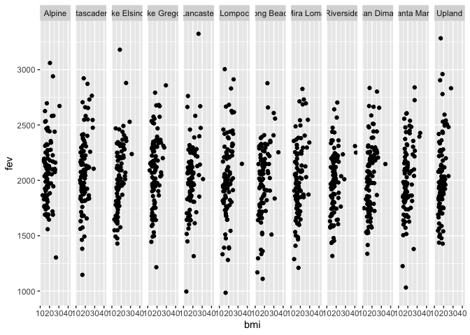

Assignment2
================
Sylvia Baeyens
10/7/2021

Loading Data Files & Merging

``` r
# Reading individual data set
individual <- data.table::fread("chs_individual.csv")

# Reading the regional data
regional <- data.table::fread("chs_regional.csv")

# Merging by location
MData <- merge(
  x = individual,
  y = regional,
  all.x = TRUE, all.y = FALSE
)
#the only common column was that of townname, don't need to specify a by.x/by.y
```

# Data Wrangling

# 1. Data Cleanup

After merging the data, make sure you don’t have any duplicates by
counting the number of rows. Make sure it matches. In the case of
missing values, impute data using the average within the variables
“male” and “hispanic.” If you are interested (and feel adventurous) in
the theme of Data Imputation, take a look at this paper on “Multiple
Imputation” using the Amelia R package here.

``` r
dim(individual)
```

    ## [1] 1200   23

``` r
dim(MData)
```

    ## [1] 1200   49

``` r
# both have 1200 rows, so there are no duplicates

summary(is.na(MData))
```

    ##   townname          sid             male            race        
    ##  Mode :logical   Mode :logical   Mode :logical   Mode :logical  
    ##  FALSE:1200      FALSE:1200      FALSE:1200      FALSE:1200     
    ##                                                                 
    ##   hispanic         agepft          height          weight       
    ##  Mode :logical   Mode :logical   Mode :logical   Mode :logical  
    ##  FALSE:1200      FALSE:1111      FALSE:1111      FALSE:1111     
    ##                  TRUE :89        TRUE :89        TRUE :89       
    ##     bmi            asthma        active_asthma   father_asthma  
    ##  Mode :logical   Mode :logical   Mode :logical   Mode :logical  
    ##  FALSE:1111      FALSE:1169      FALSE:1200      FALSE:1094     
    ##  TRUE :89        TRUE :31                        TRUE :106      
    ##  mother_asthma     wheeze         hayfever        allergy       
    ##  Mode :logical   Mode :logical   Mode :logical   Mode :logical  
    ##  FALSE:1144      FALSE:1129      FALSE:1082      FALSE:1137     
    ##  TRUE :56        TRUE :71        TRUE :118       TRUE :63       
    ##  educ_parent       smoke            pets          gasstove      
    ##  Mode :logical   Mode :logical   Mode :logical   Mode :logical  
    ##  FALSE:1136      FALSE:1160      FALSE:1200      FALSE:1167     
    ##  TRUE :64        TRUE :40                        TRUE :33       
    ##     fev             fvc             mmef         pm25_mass      
    ##  Mode :logical   Mode :logical   Mode :logical   Mode :logical  
    ##  FALSE:1105      FALSE:1103      FALSE:1094      FALSE:1200     
    ##  TRUE :95        TRUE :97        TRUE :106                      
    ##   pm25_so4        pm25_no3        pm25_nh4        pm25_oc       
    ##  Mode :logical   Mode :logical   Mode :logical   Mode :logical  
    ##  FALSE:1200      FALSE:1200      FALSE:1200      FALSE:1200     
    ##                                                                 
    ##   pm25_ec         pm25_om         pm10_oc         pm10_ec       
    ##  Mode :logical   Mode :logical   Mode :logical   Mode :logical  
    ##  FALSE:1200      FALSE:1200      FALSE:1200      FALSE:1200     
    ##                                                                 
    ##   pm10_tc          formic          acetic           hcl         
    ##  Mode :logical   Mode :logical   Mode :logical   Mode :logical  
    ##  FALSE:1200      FALSE:1200      FALSE:1200      FALSE:1200     
    ##                                                                 
    ##     hno3           o3_max          o3106           o3_24        
    ##  Mode :logical   Mode :logical   Mode :logical   Mode :logical  
    ##  FALSE:1200      FALSE:1200      FALSE:1200      FALSE:1200     
    ##                                                                 
    ##     no2             pm10          no_24hr         pm2_5_fr      
    ##  Mode :logical   Mode :logical   Mode :logical   Mode :logical  
    ##  FALSE:1200      FALSE:1200      FALSE:1100      FALSE:900      
    ##                                  TRUE :100       TRUE :300      
    ##    iacid           oacid         total_acids        lon         
    ##  Mode :logical   Mode :logical   Mode :logical   Mode :logical  
    ##  FALSE:1200      FALSE:1200      FALSE:1200      FALSE:1200     
    ##                                                                 
    ##     lat         
    ##  Mode :logical  
    ##  FALSE:1200     
    ## 

``` r
#there is missing data for agepft, height, weight, bmi, asthma, father_asmtha, mother_asthma, wheeze, hayfever, allergy, educ_parent, smoke, gasstove,fev, fvc, mmef, no_24hr, and pm 2_5_fr 

# imputing for bmi, smoke, gasstove & fev based on gender & race as these are the variables we will be inspecting later

MData[, bmi := fcoalesce(bmi, mean(bmi, na.rm = TRUE)),
    by = .(male, hispanic)]
MData[, fev := fcoalesce(fev, mean(fev, na.rm = TRUE)),
    by = .(male, hispanic)]

# could not impute for gasstove & smoke because they are binary
```

# 2. New Obesity Level variable

Create a new categorical variable named “obesity\_level” using the BMI
measurement (underweight BMI&lt;14; normal BMI 14-22; overweight BMI
22-24; obese BMI&gt;24). To make sure the variable is rightly coded,
create a summary table that contains the minimum BMI, maximum BMI, and
the total number of observations per category.

``` r
MData[bmi< 14,obesity_level:="underweight"]
MData[bmi>= 14 & bmi< 22,obesity_level:="normal"]
MData[bmi>= 22 & bmi< 24,obesity_level:="overweight"]
MData[bmi>= 24,obesity_level:="obese"]

MData[, .(
    min_BMI = min(bmi, na.rm=TRUE),
    max_BMI = max(bmi, na.rm=TRUE),
    total_num = .N
    ),
    by = obesity_level
    ] %>% head(n = 4)
```

    ##    obesity_level  min_BMI  max_BMI total_num
    ## 1:        normal 14.00380 21.96387       975
    ## 2:    overweight 22.02353 23.99650        87
    ## 3:         obese 24.00647 41.26613       103
    ## 4:   underweight 11.29640 13.98601        35

# 3. New exposure variable

Create another categorical variable named “smoke\_gas\_exposure” that
summarizes “Second Hand Smoke” and “Gas Stove.” The variable should have
four categories in total.

``` r
MData[smoke == 0 & gasstove == 0,smoke_gas_exposure:="no exposure"]
MData[smoke == 1 & gasstove == 0,smoke_gas_exposure:="smoke exposure"]
MData[smoke == 0 & gasstove == 1,smoke_gas_exposure:="gas exposure"]
MData[smoke == 1 & gasstove == 1,smoke_gas_exposure:="smoke & gas exposure"]

MData[,.(
  obs= .N),
  by = smoke_gas_exposure
]%>% head(n = 5)
```

    ##      smoke_gas_exposure obs
    ## 1:          no exposure 214
    ## 2:                 <NA>  60
    ## 3:       smoke exposure  36
    ## 4:         gas exposure 739
    ## 5: smoke & gas exposure 151

# 4. Summary Tables

Create four summary tables showing the average (or proportion, if
binary) and sd of “Forced expiratory volume in 1 second (ml)” and asthma
indicator by town, sex, obesity level, and “smoke\_gas\_exposure.”

``` r
MData[, .(
    average_FEV = mean(fev, na.rm=TRUE),
    standarddev_FEV = sd(fev, na.rm=TRUE),
    average_asthmaindic = mean(asthma, na.rm=TRUE),
    standarddev_asthmaindic = sd(asthma, na.rm=TRUE)
    ),
    by = townname
    ] %>% head(n = 4)
```

    ##         townname average_FEV standarddev_FEV average_asthmaindic
    ## 1:        Alpine    2087.101        291.1768           0.1134021
    ## 2:    Atascadero    2075.897        324.0935           0.2551020
    ## 3: Lake Elsinore    2038.849        303.6956           0.1263158
    ## 4:  Lake Gregory    2084.700        319.9593           0.1515152
    ##    standarddev_asthmaindic
    ## 1:               0.3187308
    ## 2:               0.4381598
    ## 3:               0.3339673
    ## 4:               0.3603750

``` r
MData[, .(
    average_FEV = mean(fev, na.rm=TRUE),
    standarddev_FEV = sd(fev, na.rm=TRUE),
    average_asthmaindic = mean(asthma, na.rm=TRUE),
    standarddev_asthmaindic = sd(asthma, na.rm=TRUE)
    ),
    by = male
    ] %>% head(n = 4)
```

    ##    male average_FEV standarddev_FEV average_asthmaindic standarddev_asthmaindic
    ## 1:    0    1958.911        311.9181           0.1208054               0.3261747
    ## 2:    1    2103.787        307.5123           0.1727749               0.3783828

``` r
MData[, .(
    average_FEV = mean(fev, na.rm=TRUE),
    standarddev_FEV = sd(fev, na.rm=TRUE),
    average_asthmaindic = mean(asthma, na.rm=TRUE),
    standarddev_asthmaindic = sd(asthma, na.rm=TRUE)
    ),
    by = obesity_level
    ] %>% head(n = 4)
```

    ##    obesity_level average_FEV standarddev_FEV average_asthmaindic
    ## 1:        normal    1999.794        295.1964          0.14014752
    ## 2:    overweight    2224.322        317.4261          0.16470588
    ## 3:         obese    2266.154        325.4710          0.21000000
    ## 4:   underweight    1698.327        303.3983          0.08571429
    ##    standarddev_asthmaindic
    ## 1:               0.3473231
    ## 2:               0.3731162
    ## 3:               0.4093602
    ## 4:               0.2840286

``` r
MData[, .(
    average_FEV = mean(fev, na.rm=TRUE),
    standarddev_FEV = sd(fev, na.rm=TRUE),
    average_asthmaindic = mean(asthma, na.rm=TRUE),
    standarddev_asthmaindic = sd(asthma, na.rm=TRUE)
    ),
    by = smoke_gas_exposure
    ] %>% head(n = 4)
```

    ##    smoke_gas_exposure average_FEV standarddev_FEV average_asthmaindic
    ## 1:        no exposure    2055.356        330.4169           0.1476190
    ## 2:               <NA>    2001.878        340.2592           0.1489362
    ## 3:     smoke exposure    2055.714        295.6475           0.1714286
    ## 4:       gas exposure    2025.989        317.6305           0.1477428
    ##    standarddev_asthmaindic
    ## 1:               0.3555696
    ## 2:               0.3598746
    ## 3:               0.3823853
    ## 4:               0.3550878

# Looking at the Data- EDA

The three questions of interest are: 1. What is the association between
BMI and FEV (forced expiratory volume)? 2. What is the association
between smoke and gas exposure and FEV? 3. What is the association
between PM2.5 exposure and FEV?

# Data Visualization

1.  Scatter plot comparing BMI vs FEV by townname

``` r
ggplot(MData, aes(x=bmi, y=fev)) +
  geom_point() +
  facet_grid(~townname)
```

<!-- -->

``` r
#add regression lines & make subplot esque organization
```

2.  Stacked histograms of FEV by BMI category and FEV by smoke/gas
    exposure.

``` r
# change default theme
```

3.  Barchart of BMI by smoke/gas exposure.

4.  Statistical summary graphs of FEV by BMI and FEV by smoke/gas
    exposure category

5.  A leaflet map showing the concentrations of PM2.5 mass in each of
    the CHS communities.

``` r
#make sure leaflet graph doesn't print in knit github document- check lecture and github notes
```

6.  Choose a visualization to examine whether PM2.5 mass is associated
    with FEV.

``` r
ggplot(MData, aes(x=fev, y=pm25_mass)) +
  geom_point() 
```

<!-- -->
