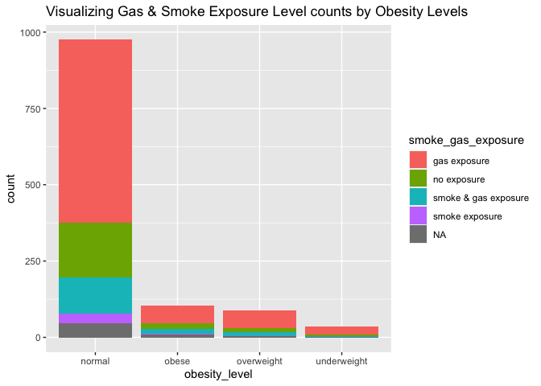

Assignment2
================
Sylvia Baeyens
10/7/2021

## Loading Data Files & Merging

``` r
# Reading individual data set
individual <- data.table::fread("chs_individual.csv")

# Reading the regional data
regional <- data.table::fread("chs_regional.csv")

# Merging by location
MData <- merge(
  x = individual,
  y = regional,
  all.x = TRUE, all.y = FALSE
)
#the only common column was that of townname, don't need to specify a by.x/by.y
```

# Data Wrangling

## 1. Data Cleanup

After merging the data, make sure you don’t have any duplicates by
counting the number of rows. Make sure it matches. In the case of
missing values, impute data using the average within the variables
“male” and “hispanic.” If you are interested (and feel adventurous) in
the theme of Data Imputation, take a look at this paper on “Multiple
Imputation” using the Amelia R package here.

``` r
dim(individual)
```

    ## [1] 1200   23

``` r
dim(MData)
```

    ## [1] 1200   49

``` r
# both have 1200 rows, so there are no duplicates

summary(is.na(MData))
```

    ##   townname          sid             male            race        
    ##  Mode :logical   Mode :logical   Mode :logical   Mode :logical  
    ##  FALSE:1200      FALSE:1200      FALSE:1200      FALSE:1200     
    ##                                                                 
    ##   hispanic         agepft          height          weight       
    ##  Mode :logical   Mode :logical   Mode :logical   Mode :logical  
    ##  FALSE:1200      FALSE:1111      FALSE:1111      FALSE:1111     
    ##                  TRUE :89        TRUE :89        TRUE :89       
    ##     bmi            asthma        active_asthma   father_asthma  
    ##  Mode :logical   Mode :logical   Mode :logical   Mode :logical  
    ##  FALSE:1111      FALSE:1169      FALSE:1200      FALSE:1094     
    ##  TRUE :89        TRUE :31                        TRUE :106      
    ##  mother_asthma     wheeze         hayfever        allergy       
    ##  Mode :logical   Mode :logical   Mode :logical   Mode :logical  
    ##  FALSE:1144      FALSE:1129      FALSE:1082      FALSE:1137     
    ##  TRUE :56        TRUE :71        TRUE :118       TRUE :63       
    ##  educ_parent       smoke            pets          gasstove      
    ##  Mode :logical   Mode :logical   Mode :logical   Mode :logical  
    ##  FALSE:1136      FALSE:1160      FALSE:1200      FALSE:1167     
    ##  TRUE :64        TRUE :40                        TRUE :33       
    ##     fev             fvc             mmef         pm25_mass      
    ##  Mode :logical   Mode :logical   Mode :logical   Mode :logical  
    ##  FALSE:1105      FALSE:1103      FALSE:1094      FALSE:1200     
    ##  TRUE :95        TRUE :97        TRUE :106                      
    ##   pm25_so4        pm25_no3        pm25_nh4        pm25_oc       
    ##  Mode :logical   Mode :logical   Mode :logical   Mode :logical  
    ##  FALSE:1200      FALSE:1200      FALSE:1200      FALSE:1200     
    ##                                                                 
    ##   pm25_ec         pm25_om         pm10_oc         pm10_ec       
    ##  Mode :logical   Mode :logical   Mode :logical   Mode :logical  
    ##  FALSE:1200      FALSE:1200      FALSE:1200      FALSE:1200     
    ##                                                                 
    ##   pm10_tc          formic          acetic           hcl         
    ##  Mode :logical   Mode :logical   Mode :logical   Mode :logical  
    ##  FALSE:1200      FALSE:1200      FALSE:1200      FALSE:1200     
    ##                                                                 
    ##     hno3           o3_max          o3106           o3_24        
    ##  Mode :logical   Mode :logical   Mode :logical   Mode :logical  
    ##  FALSE:1200      FALSE:1200      FALSE:1200      FALSE:1200     
    ##                                                                 
    ##     no2             pm10          no_24hr         pm2_5_fr      
    ##  Mode :logical   Mode :logical   Mode :logical   Mode :logical  
    ##  FALSE:1200      FALSE:1200      FALSE:1100      FALSE:900      
    ##                                  TRUE :100       TRUE :300      
    ##    iacid           oacid         total_acids        lon         
    ##  Mode :logical   Mode :logical   Mode :logical   Mode :logical  
    ##  FALSE:1200      FALSE:1200      FALSE:1200      FALSE:1200     
    ##                                                                 
    ##     lat         
    ##  Mode :logical  
    ##  FALSE:1200     
    ## 

``` r
#there is missing data for agepft, height, weight, bmi, asthma, father_asmtha, mother_asthma, wheeze, hayfever, allergy, educ_parent, smoke, gasstove,fev, fvc, mmef, no_24hr, and pm 2_5_fr 

# imputing for bmi, smoke, gasstove & fev based on gender & race as these are the variables we will be inspecting later

MData[, bmi := fcoalesce(bmi, mean(bmi, na.rm = TRUE)),
    by = .(male, hispanic)]
MData[, fev := fcoalesce(fev, mean(fev, na.rm = TRUE)),
    by = .(male, hispanic)]

# could not impute for gasstove & smoke because they are binary
```

## 2. New Obesity Level variable

Create a new categorical variable named “obesity\_level” using the BMI
measurement (underweight BMI&lt;14; normal BMI 14-22; overweight BMI
22-24; obese BMI&gt;24). To make sure the variable is rightly coded,
create a summary table that contains the minimum BMI, maximum BMI, and
the total number of observations per category.

``` r
MData[bmi< 14,obesity_level:="underweight"]
MData[bmi>= 14 & bmi< 22,obesity_level:="normal"]
MData[bmi>= 22 & bmi< 24,obesity_level:="overweight"]
MData[bmi>= 24,obesity_level:="obese"]

MData[, .(
    min_BMI = min(bmi, na.rm=TRUE),
    max_BMI = max(bmi, na.rm=TRUE),
    total_num = .N
    ),
    by = obesity_level
    ] %>% head(n = 4)
```

    ##    obesity_level  min_BMI  max_BMI total_num
    ## 1:        normal 14.00380 21.96387       975
    ## 2:    overweight 22.02353 23.99650        87
    ## 3:         obese 24.00647 41.26613       103
    ## 4:   underweight 11.29640 13.98601        35

## 3. New exposure variable

Create another categorical variable named “smoke\_gas\_exposure” that
summarizes “Second Hand Smoke” and “Gas Stove.” The variable should have
four categories in total.

``` r
MData[smoke == 0 & gasstove == 0,smoke_gas_exposure:="no exposure"]
MData[smoke == 1 & gasstove == 0,smoke_gas_exposure:="smoke exposure"]
MData[smoke == 0 & gasstove == 1,smoke_gas_exposure:="gas exposure"]
MData[smoke == 1 & gasstove == 1,smoke_gas_exposure:="smoke & gas exposure"]

MData[,.(
  obs= .N),
  by = smoke_gas_exposure
]%>% head(n = 5)
```

    ##      smoke_gas_exposure obs
    ## 1:          no exposure 214
    ## 2:                 <NA>  60
    ## 3:       smoke exposure  36
    ## 4:         gas exposure 739
    ## 5: smoke & gas exposure 151

## 4. Summary Tables

Create four summary tables showing the average (or proportion, if
binary) and sd of “Forced expiratory volume in 1 second (ml)” and asthma
indicator by town, sex, obesity level, and “smoke\_gas\_exposure.”

``` r
MData[, .(
    average_FEV = mean(fev, na.rm=TRUE),
    standarddev_FEV = sd(fev, na.rm=TRUE),
    average_asthmaindic = mean(asthma, na.rm=TRUE),
    standarddev_asthmaindic = sd(asthma, na.rm=TRUE)
    ),
    by = townname
    ] %>% knitr::kable(caption = "Average FEV & Asthma Indicator by Town")
```

| townname      | average\_FEV | standarddev\_FEV | average\_asthmaindic | standarddev\_asthmaindic |
|:--------------|-------------:|-----------------:|---------------------:|-------------------------:|
| Alpine        |     2087.101 |         291.1768 |            0.1134021 |                0.3187308 |
| Atascadero    |     2075.897 |         324.0935 |            0.2551020 |                0.4381598 |
| Lake Elsinore |     2038.849 |         303.6956 |            0.1263158 |                0.3339673 |
| Lake Gregory  |     2084.700 |         319.9593 |            0.1515152 |                0.3603750 |
| Lancaster     |     2003.044 |         317.1298 |            0.1649485 |                0.3730620 |
| Lompoc        |     2034.354 |         351.0454 |            0.1134021 |                0.3187308 |
| Long Beach    |     1985.861 |         319.4625 |            0.1354167 |                0.3439642 |
| Mira Loma     |     1985.202 |         324.9634 |            0.1578947 |                0.3665767 |
| Riverside     |     1989.881 |         277.5065 |            0.1100000 |                0.3144660 |
| San Dimas     |     2026.794 |         318.7845 |            0.1717172 |                0.3790537 |
| Santa Maria   |     2025.750 |         312.1725 |            0.1340206 |                0.3424442 |
| Upland        |     2024.266 |         343.1637 |            0.1212121 |                0.3280346 |

Average FEV & Asthma Indicator by Town

``` r
MData[, .(
    average_FEV = mean(fev, na.rm=TRUE),
    standarddev_FEV = sd(fev, na.rm=TRUE),
    average_asthmaindic = mean(asthma, na.rm=TRUE),
    standarddev_asthmaindic = sd(asthma, na.rm=TRUE)
    ),
    by = male
    ] %>% knitr::kable(caption = "Average FEV & Asthma Indicator by Sex")
```

| male | average\_FEV | standarddev\_FEV | average\_asthmaindic | standarddev\_asthmaindic |
|-----:|-------------:|-----------------:|---------------------:|-------------------------:|
|    0 |     1958.911 |         311.9181 |            0.1208054 |                0.3261747 |
|    1 |     2103.787 |         307.5123 |            0.1727749 |                0.3783828 |

Average FEV & Asthma Indicator by Sex

``` r
MData[, .(
    average_FEV = mean(fev, na.rm=TRUE),
    standarddev_FEV = sd(fev, na.rm=TRUE),
    average_asthmaindic = mean(asthma, na.rm=TRUE),
    standarddev_asthmaindic = sd(asthma, na.rm=TRUE)
    ),
    by = obesity_level
    ] %>% knitr::kable(caption = "Average FEV & Asthma Indicator by Obesity Level")
```

| obesity\_level | average\_FEV | standarddev\_FEV | average\_asthmaindic | standarddev\_asthmaindic |
|:---------------|-------------:|-----------------:|---------------------:|-------------------------:|
| normal         |     1999.794 |         295.1964 |            0.1401475 |                0.3473231 |
| overweight     |     2224.322 |         317.4261 |            0.1647059 |                0.3731162 |
| obese          |     2266.154 |         325.4710 |            0.2100000 |                0.4093602 |
| underweight    |     1698.327 |         303.3983 |            0.0857143 |                0.2840286 |

Average FEV & Asthma Indicator by Obesity Level

``` r
MData[, .(
    average_FEV = mean(fev, na.rm=TRUE),
    standarddev_FEV = sd(fev, na.rm=TRUE),
    average_asthmaindic = mean(asthma, na.rm=TRUE),
    standarddev_asthmaindic = sd(asthma, na.rm=TRUE)
    ),
    by = smoke_gas_exposure
    ] %>% knitr::kable(caption = "Average FEV & Asthma Indicator by Smoke & Gas Exposure")
```

| smoke\_gas\_exposure | average\_FEV | standarddev\_FEV | average\_asthmaindic | standarddev\_asthmaindic |
|:---------------------|-------------:|-----------------:|---------------------:|-------------------------:|
| no exposure          |     2055.356 |         330.4169 |            0.1476190 |                0.3555696 |
| NA                   |     2001.878 |         340.2592 |            0.1489362 |                0.3598746 |
| smoke exposure       |     2055.714 |         295.6475 |            0.1714286 |                0.3823853 |
| gas exposure         |     2025.989 |         317.6305 |            0.1477428 |                0.3550878 |
| smoke & gas exposure |     2019.867 |         298.9728 |            0.1301370 |                0.3376123 |

Average FEV & Asthma Indicator by Smoke & Gas Exposure

# Looking at the Data- EDA

The three questions of interest are: 1. What is the association between
BMI and FEV (forced expiratory volume)? 2. What is the association
between smoke and gas exposure and FEV? 3. What is the association
between PM2.5 exposure and FEV?

## EDA Checklist

Checking Dimensions & headers/footers

``` r
dim(MData)
```

    ## [1] 1200   51

``` r
head(MData)
```

    ##    townname sid male race hispanic    agepft height weight      bmi asthma
    ## 1:   Alpine 835    0    W        0 10.099932    143     69 15.33749      0
    ## 2:   Alpine 838    0    O        1  9.486653    133     62 15.93183      0
    ## 3:   Alpine 839    0    M        1 10.053388    142     86 19.38649      0
    ## 4:   Alpine 840    0    W        0  9.965777    146     78 16.63283      0
    ## 5:   Alpine 841    1    W        1 10.548939    150     78 15.75758      0
    ## 6:   Alpine 842    1    M        1  9.489391    139     65 15.29189      0
    ##    active_asthma father_asthma mother_asthma wheeze hayfever allergy
    ## 1:             0             0             0      0        0       1
    ## 2:             0             0             0      0        0       0
    ## 3:             0             0             1      1        1       1
    ## 4:             0             0             0      0        0       0
    ## 5:             0             0             0      0        0       0
    ## 6:             0             0             0      1        0       0
    ##    educ_parent smoke pets gasstove      fev      fvc     mmef pm25_mass
    ## 1:           3     0    1        0 2529.276 2826.316 3406.579      8.74
    ## 2:           4    NA    1        0 1737.793 1963.545 2133.110      8.74
    ## 3:           3     1    1        0 2121.711 2326.974 2835.197      8.74
    ## 4:          NA    NA    0       NA 2466.791 2638.221 3466.464      8.74
    ## 5:           5     0    1        0 2251.505 2594.649 2445.151      8.74
    ## 6:           1     1    1        0 2188.716 2423.934 2524.599      8.74
    ##    pm25_so4 pm25_no3 pm25_nh4 pm25_oc pm25_ec pm25_om pm10_oc pm10_ec pm10_tc
    ## 1:     1.73     1.59     0.88    2.54    0.48    3.04    3.25    0.49    3.75
    ## 2:     1.73     1.59     0.88    2.54    0.48    3.04    3.25    0.49    3.75
    ## 3:     1.73     1.59     0.88    2.54    0.48    3.04    3.25    0.49    3.75
    ## 4:     1.73     1.59     0.88    2.54    0.48    3.04    3.25    0.49    3.75
    ## 5:     1.73     1.59     0.88    2.54    0.48    3.04    3.25    0.49    3.75
    ## 6:     1.73     1.59     0.88    2.54    0.48    3.04    3.25    0.49    3.75
    ##    formic acetic  hcl hno3 o3_max o3106 o3_24   no2  pm10 no_24hr pm2_5_fr
    ## 1:   1.03   2.49 0.41 1.98  65.82 55.05 41.23 12.18 24.73    2.48    10.28
    ## 2:   1.03   2.49 0.41 1.98  65.82 55.05 41.23 12.18 24.73    2.48    10.28
    ## 3:   1.03   2.49 0.41 1.98  65.82 55.05 41.23 12.18 24.73    2.48    10.28
    ## 4:   1.03   2.49 0.41 1.98  65.82 55.05 41.23 12.18 24.73    2.48    10.28
    ## 5:   1.03   2.49 0.41 1.98  65.82 55.05 41.23 12.18 24.73    2.48    10.28
    ## 6:   1.03   2.49 0.41 1.98  65.82 55.05 41.23 12.18 24.73    2.48    10.28
    ##    iacid oacid total_acids       lon      lat obesity_level smoke_gas_exposure
    ## 1:  2.39  3.52         5.5 -116.7664 32.83505        normal        no exposure
    ## 2:  2.39  3.52         5.5 -116.7664 32.83505        normal               <NA>
    ## 3:  2.39  3.52         5.5 -116.7664 32.83505        normal     smoke exposure
    ## 4:  2.39  3.52         5.5 -116.7664 32.83505        normal               <NA>
    ## 5:  2.39  3.52         5.5 -116.7664 32.83505        normal        no exposure
    ## 6:  2.39  3.52         5.5 -116.7664 32.83505        normal     smoke exposure

``` r
tail(MData)
```

    ##    townname  sid male race hispanic    agepft height weight      bmi asthma
    ## 1:   Upland 1866    0    O        1  9.806982    139     60 14.11559      0
    ## 2:   Upland 1867    0    M        1  9.618070    140     71 16.46568      0
    ## 3:   Upland 2031    1    W        0  9.798768    135     83 20.70084      0
    ## 4:   Upland 2032    1    W        0  9.549624    137     59 14.28855      0
    ## 5:   Upland 2033    0    M        0 10.121834    130     67 18.02044      0
    ## 6:   Upland 2053    0    W        0        NA     NA     NA 18.05281      0
    ##    active_asthma father_asthma mother_asthma wheeze hayfever allergy
    ## 1:             0            NA             0      0       NA      NA
    ## 2:             0             1             0      0        0       0
    ## 3:             0             0             0      1        0       1
    ## 4:             0             0             1      1        1       1
    ## 5:             1             0             0      1        1       0
    ## 6:             0             0             0      0        0       0
    ##    educ_parent smoke pets gasstove      fev      fvc     mmef pm25_mass
    ## 1:           3     0    1        0 1691.275 1928.859 1890.604     22.46
    ## 2:           3     0    1        0 1733.338 1993.040 2072.643     22.46
    ## 3:           3     0    1        1 2034.177 2505.535 1814.075     22.46
    ## 4:           3     0    1        1 2077.703 2275.338 2706.081     22.46
    ## 5:           3     0    1        1 1929.866 2122.148 2558.054     22.46
    ## 6:           3     0    1        0 1945.743       NA       NA     22.46
    ##    pm25_so4 pm25_no3 pm25_nh4 pm25_oc pm25_ec pm25_om pm10_oc pm10_ec pm10_tc
    ## 1:     2.65     7.75     2.96    6.49    1.19    7.79    8.32    1.22    9.54
    ## 2:     2.65     7.75     2.96    6.49    1.19    7.79    8.32    1.22    9.54
    ## 3:     2.65     7.75     2.96    6.49    1.19    7.79    8.32    1.22    9.54
    ## 4:     2.65     7.75     2.96    6.49    1.19    7.79    8.32    1.22    9.54
    ## 5:     2.65     7.75     2.96    6.49    1.19    7.79    8.32    1.22    9.54
    ## 6:     2.65     7.75     2.96    6.49    1.19    7.79    8.32    1.22    9.54
    ##    formic acetic  hcl hno3 o3_max o3106 o3_24   no2 pm10 no_24hr pm2_5_fr iacid
    ## 1:   2.67   4.73 0.46 4.03  63.83  46.5  22.2 37.97 40.8   18.48    27.73  4.49
    ## 2:   2.67   4.73 0.46 4.03  63.83  46.5  22.2 37.97 40.8   18.48    27.73  4.49
    ## 3:   2.67   4.73 0.46 4.03  63.83  46.5  22.2 37.97 40.8   18.48    27.73  4.49
    ## 4:   2.67   4.73 0.46 4.03  63.83  46.5  22.2 37.97 40.8   18.48    27.73  4.49
    ## 5:   2.67   4.73 0.46 4.03  63.83  46.5  22.2 37.97 40.8   18.48    27.73  4.49
    ## 6:   2.67   4.73 0.46 4.03  63.83  46.5  22.2 37.97 40.8   18.48    27.73  4.49
    ##    oacid total_acids       lon      lat obesity_level smoke_gas_exposure
    ## 1:   7.4       11.43 -117.6484 34.09751        normal        no exposure
    ## 2:   7.4       11.43 -117.6484 34.09751        normal        no exposure
    ## 3:   7.4       11.43 -117.6484 34.09751        normal       gas exposure
    ## 4:   7.4       11.43 -117.6484 34.09751        normal       gas exposure
    ## 5:   7.4       11.43 -117.6484 34.09751        normal       gas exposure
    ## 6:   7.4       11.43 -117.6484 34.09751        normal        no exposure

Checking Variable Types & Taking Closer Look at Key Variables

``` r
str(MData)
```

    ## Classes 'data.table' and 'data.frame':   1200 obs. of  51 variables:
    ##  $ townname          : chr  "Alpine" "Alpine" "Alpine" "Alpine" ...
    ##  $ sid               : int  835 838 839 840 841 842 843 844 847 849 ...
    ##  $ male              : int  0 0 0 0 1 1 1 1 1 1 ...
    ##  $ race              : chr  "W" "O" "M" "W" ...
    ##  $ hispanic          : int  0 1 1 0 1 1 0 1 0 0 ...
    ##  $ agepft            : num  10.1 9.49 10.05 9.97 10.55 ...
    ##  $ height            : int  143 133 142 146 150 139 149 143 137 147 ...
    ##  $ weight            : int  69 62 86 78 78 65 98 65 69 112 ...
    ##  $ bmi               : num  15.3 15.9 19.4 16.6 15.8 ...
    ##  $ asthma            : int  0 0 0 0 0 0 0 NA 0 0 ...
    ##  $ active_asthma     : int  0 0 0 0 0 0 0 0 0 0 ...
    ##  $ father_asthma     : int  0 0 0 0 0 0 0 NA 0 1 ...
    ##  $ mother_asthma     : int  0 0 1 0 0 0 0 NA 0 0 ...
    ##  $ wheeze            : int  0 0 1 0 0 1 1 NA 0 1 ...
    ##  $ hayfever          : int  0 0 1 0 0 0 0 NA 0 0 ...
    ##  $ allergy           : int  1 0 1 0 0 0 1 NA 0 1 ...
    ##  $ educ_parent       : int  3 4 3 NA 5 1 3 NA 5 3 ...
    ##  $ smoke             : int  0 NA 1 NA 0 1 0 NA 0 0 ...
    ##  $ pets              : int  1 1 1 0 1 1 1 0 1 1 ...
    ##  $ gasstove          : int  0 0 0 NA 0 0 1 NA 1 0 ...
    ##  $ fev               : num  2529 1738 2122 2467 2252 ...
    ##  $ fvc               : num  2826 1964 2327 2638 2595 ...
    ##  $ mmef              : num  3407 2133 2835 3466 2445 ...
    ##  $ pm25_mass         : num  8.74 8.74 8.74 8.74 8.74 8.74 8.74 8.74 8.74 8.74 ...
    ##  $ pm25_so4          : num  1.73 1.73 1.73 1.73 1.73 1.73 1.73 1.73 1.73 1.73 ...
    ##  $ pm25_no3          : num  1.59 1.59 1.59 1.59 1.59 1.59 1.59 1.59 1.59 1.59 ...
    ##  $ pm25_nh4          : num  0.88 0.88 0.88 0.88 0.88 0.88 0.88 0.88 0.88 0.88 ...
    ##  $ pm25_oc           : num  2.54 2.54 2.54 2.54 2.54 2.54 2.54 2.54 2.54 2.54 ...
    ##  $ pm25_ec           : num  0.48 0.48 0.48 0.48 0.48 0.48 0.48 0.48 0.48 0.48 ...
    ##  $ pm25_om           : num  3.04 3.04 3.04 3.04 3.04 3.04 3.04 3.04 3.04 3.04 ...
    ##  $ pm10_oc           : num  3.25 3.25 3.25 3.25 3.25 3.25 3.25 3.25 3.25 3.25 ...
    ##  $ pm10_ec           : num  0.49 0.49 0.49 0.49 0.49 0.49 0.49 0.49 0.49 0.49 ...
    ##  $ pm10_tc           : num  3.75 3.75 3.75 3.75 3.75 3.75 3.75 3.75 3.75 3.75 ...
    ##  $ formic            : num  1.03 1.03 1.03 1.03 1.03 1.03 1.03 1.03 1.03 1.03 ...
    ##  $ acetic            : num  2.49 2.49 2.49 2.49 2.49 2.49 2.49 2.49 2.49 2.49 ...
    ##  $ hcl               : num  0.41 0.41 0.41 0.41 0.41 0.41 0.41 0.41 0.41 0.41 ...
    ##  $ hno3              : num  1.98 1.98 1.98 1.98 1.98 1.98 1.98 1.98 1.98 1.98 ...
    ##  $ o3_max            : num  65.8 65.8 65.8 65.8 65.8 ...
    ##  $ o3106             : num  55 55 55 55 55 ...
    ##  $ o3_24             : num  41.2 41.2 41.2 41.2 41.2 ...
    ##  $ no2               : num  12.2 12.2 12.2 12.2 12.2 ...
    ##  $ pm10              : num  24.7 24.7 24.7 24.7 24.7 ...
    ##  $ no_24hr           : num  2.48 2.48 2.48 2.48 2.48 2.48 2.48 2.48 2.48 2.48 ...
    ##  $ pm2_5_fr          : num  10.3 10.3 10.3 10.3 10.3 ...
    ##  $ iacid             : num  2.39 2.39 2.39 2.39 2.39 2.39 2.39 2.39 2.39 2.39 ...
    ##  $ oacid             : num  3.52 3.52 3.52 3.52 3.52 3.52 3.52 3.52 3.52 3.52 ...
    ##  $ total_acids       : num  5.5 5.5 5.5 5.5 5.5 5.5 5.5 5.5 5.5 5.5 ...
    ##  $ lon               : num  -117 -117 -117 -117 -117 ...
    ##  $ lat               : num  32.8 32.8 32.8 32.8 32.8 ...
    ##  $ obesity_level     : chr  "normal" "normal" "normal" "normal" ...
    ##  $ smoke_gas_exposure: chr  "no exposure" NA "smoke exposure" NA ...
    ##  - attr(*, ".internal.selfref")=<externalptr> 
    ##  - attr(*, "sorted")= chr "townname"
    ##  - attr(*, "index")= int(0) 
    ##   ..- attr(*, "__gasstove__smoke")= int [1:1200] 4 8 21 208 245 339 550 692 764 784 ...

``` r
summary(MData$bmi)
```

    ##    Min. 1st Qu.  Median    Mean 3rd Qu.    Max. 
    ##   11.30   15.96   17.81   18.50   19.99   41.27

``` r
summary(MData$fev)
```

    ##    Min. 1st Qu.  Median    Mean 3rd Qu.    Max. 
    ##   984.8  1827.6  2016.4  2030.1  2223.6  3323.7

``` r
summary(MData$pm25_mass)
```

    ##    Min. 1st Qu.  Median    Mean 3rd Qu.    Max. 
    ##   5.960   7.615  10.545  14.362  20.988  29.970

Summary Statistics

``` r
MData[, .(
    min_fev = min(fev, na.rm=TRUE),
    max_fev = max(fev, na.rm=TRUE),
    avg_fev = mean(fev, na.rm=TRUE),
    total_num = .N
    ),
    by = obesity_level
    ] %>% knitr::kable(caption = "FEV Summary Stats by Obesity Level")
```

| obesity\_level |  min\_fev | max\_fev | avg\_fev | total\_num |
|:---------------|----------:|---------:|---------:|-----------:|
| normal         |  984.8485 | 3283.371 | 1999.794 |        975 |
| overweight     | 1604.6600 | 2939.404 | 2224.322 |         87 |
| obese          | 1303.3445 | 3323.684 | 2266.154 |        103 |
| underweight    |  995.9596 | 2355.882 | 1698.327 |         35 |

FEV Summary Stats by Obesity Level

``` r
MData[, .(
    min_fev = min(fev, na.rm=TRUE),
    max_fev = max(fev, na.rm=TRUE),
    avg_fev = mean(fev, na.rm=TRUE),
    total_num = .N
    ),
    by = smoke_gas_exposure
    ] %>% knitr::kable(caption = "FEV Summary Stats by Smoke & Gas Exposure")
```

| smoke\_gas\_exposure |  min\_fev | max\_fev | avg\_fev | total\_num |
|:---------------------|----------:|---------:|---------:|-----------:|
| no exposure          | 1032.0000 | 3283.371 | 2055.356 |        214 |
| NA                   |  995.9596 | 2696.040 | 2001.878 |         60 |
| smoke exposure       | 1381.9461 | 3060.000 | 2055.714 |         36 |
| gas exposure         |  984.8485 | 3323.684 | 2025.989 |        739 |
| smoke & gas exposure | 1316.9785 | 2763.974 | 2019.867 |        151 |

FEV Summary Stats by Smoke & Gas Exposure

# Data Visualization

## 1. Scatter plot comparing BMI vs FEV by townname

``` r
ggplot(MData, aes(x=bmi, y=fev)) +
  geom_point() +
  facet_wrap(~townname) +
  geom_smooth(method ="lm") +
  ggtitle("BMI vs FEV in different CA towns")
```

    ## `geom_smooth()` using formula 'y ~ x'

<!-- --> It does
appear from the above graphs that there is a positive relationship
between increasing bmi and increasing FEV. For all towns, the slope of
the best fit line is greater than 0. This trend seems most apparent in
the towns of Upland, Lake Elsinore, and Atascadero, as shown by the
slopes of these best fit lines.

## 2. Stacked histograms of FEV by BMI category and FEV by smoke/gas exposure.

``` r
ggplot(MData, aes(x=fev)) +
  geom_histogram(aes(fill=obesity_level))+
  scale_fill_brewer(palette = "Pastel1") +
  ggtitle("Visualizing FEV distribution by Obesity Levels")
```

    ## `stat_bin()` using `bins = 30`. Pick better value with `binwidth`.

<!-- -->

``` r
ggplot(MData, aes(x=fev)) +
  geom_histogram(aes(fill=smoke_gas_exposure))+
  scale_fill_brewer(palette = "Pastel2") +
  ggtitle("Visualizing FEV distribution by Smoke and Gas Exposure Levels")
```

    ## `stat_bin()` using `bins = 30`. Pick better value with `binwidth`.

<!-- --> When
looking at obesity level, the distribution of fev is normal for the
normal weight group. However, for the obese & overweight groups, the
data is skewed to the right whereas for the underweight group, the data
is skewed to the left. When viewing this graph, we can assume that the
average fev for the obese and overweight groups is greater than that of
the normal group, and that the average fev for the underweight group is
less than that of the normal group.

We do not see a similar trend in the histogram showing fev by smoke &
gas exposure level. For all of these groups, the fev distribution is
normal, and one can assume that the average fev for all 4 groups is the
same.

## 3. Barchart of BMI by smoke/gas exposure.

``` r
ggplot(MData) +
  geom_bar(mapping =aes(x=obesity_level, fill=smoke_gas_exposure)) +
  ggtitle("Visualizing Gas & Smoke Exposure Level counts by Obesity Levels")
```

<!-- --> Gas
exposure is the most common form of exposure experienced by all 4
obesity level groups. The normal group seems to have the highest
percentage of individuals experiencing no exposure. Besides that, the
proportions of exposure levels appear to be the same among the different
groups, showing that there might not be that large of a relationship
between the type of exposure experienced and obesity level.

## 4. Statistical summary graphs of FEV by BMI and FEV by smoke/gas exposure category

``` r
ggplot(MData, aes(x= obesity_level, y= fev)) +
  stat_summary(fun.min = min, fun.max= max, fun = median) +
  ggtitle("Visualizing Range & Median of FEV by Obesity Levels")
```

<!-- -->

``` r
ggplot(MData, aes(x= smoke_gas_exposure, y= fev)) +
  stat_summary(fun.min = min, fun.max= max, fun = median) +
  ggtitle("Visualizing Range & Median of FEV by Obesity Levels")
```

<!-- --> The
average fev is greatest for the obese and overweight groups at about
2250, and lowest for the underweight group at 1700. The normal group has
the largest range of fev values and an average fev of 2000. The normal
and obese groups have the greatest maximum fev values, while the normal
and underweight groups have the smallest mimimum values. It can be seen
that there is some correlation between fev and obesity level, and that
there is a greater likelihood to have a large fev value at a high bmi.

## 5. A leaflet map showing the concentrations of PM2.5 mass in each of the CHS communities.

``` r
temp.pal = colorNumeric(c('darkblue','navyblue','lightblue'), domain = MData$pm25_mass)

leaflet(MData) %>%
  addProviderTiles('CartoDB.Positron') %>%
  addCircles(
    lat = ~lat, lng=~lon, 
    color = ~ temp.pal(pm25_mass),
    opacity=1, fillOpacity=1
    )  %>%
  addLegend('bottomleft', pal=temp.pal, values=MData$pm25_mass,
          title='PM2.5 Mass', opacity=1)
#make sure leaflet graph doesn't print in knit github document- check lecture and github notes
```

The mass of PM2.5 Particles is greatest in the town of Mira Loma, east
of LA. The other towns near the Riverside/San Bernardino areas also have
large PM 2.5 Mass. As you move further away, the mass of the averag
PM2.5 particles decreases.

## 6. Choose a visualization to examine whether PM2.5 mass is associated with FEV.

``` r
ggplot(MData, aes(x=fev, y=pm25_mass)) +
  geom_point() 
```

<!-- -->
