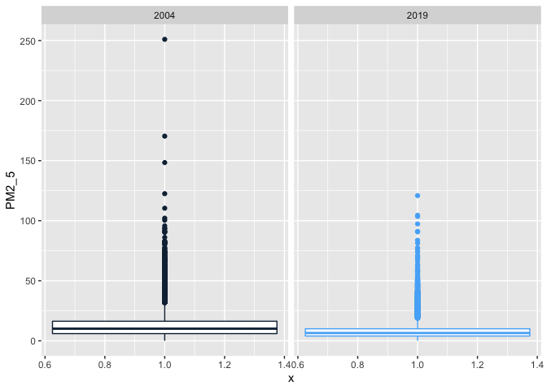
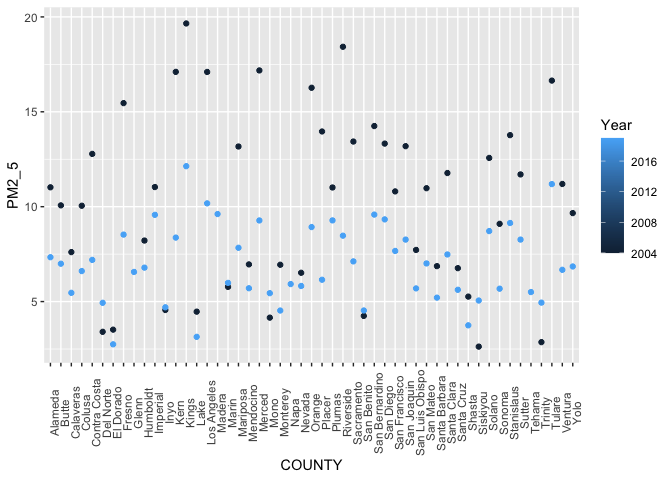
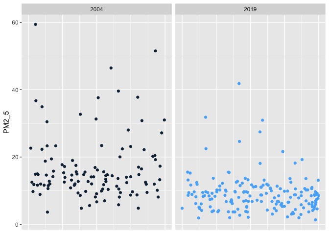

Project1
================
Sylvia Baeyens
9/20/2021

# 1a. Reading in Data Files

``` r
Data2004 = data.table::fread("ad_viz_plotval_data2004.csv")
Data2019 = data.table::fread("ad_viz_plotval_data2019.csv")
```

# 1b. Summarizing Data

``` r
# for 2005 Data
dim(Data2004)
```

    ## [1] 19233    20

``` r
head(Data2004)
```

    ##          Date Source  Site ID POC Daily Mean PM2.5 Concentration    UNITS
    ## 1: 01/01/2004    AQS 60010007   1                           11.0 ug/m3 LC
    ## 2: 01/02/2004    AQS 60010007   1                           12.2 ug/m3 LC
    ## 3: 01/03/2004    AQS 60010007   1                           16.5 ug/m3 LC
    ## 4: 01/04/2004    AQS 60010007   1                           19.5 ug/m3 LC
    ## 5: 01/05/2004    AQS 60010007   1                           11.5 ug/m3 LC
    ## 6: 01/06/2004    AQS 60010007   1                           32.5 ug/m3 LC
    ##    DAILY_AQI_VALUE Site Name DAILY_OBS_COUNT PERCENT_COMPLETE
    ## 1:              46 Livermore               1              100
    ## 2:              51 Livermore               1              100
    ## 3:              60 Livermore               1              100
    ## 4:              67 Livermore               1              100
    ## 5:              48 Livermore               1              100
    ## 6:              94 Livermore               1              100
    ##    AQS_PARAMETER_CODE                     AQS_PARAMETER_DESC CBSA_CODE
    ## 1:              88502 Acceptable PM2.5 AQI & Speciation Mass     41860
    ## 2:              88502 Acceptable PM2.5 AQI & Speciation Mass     41860
    ## 3:              88502 Acceptable PM2.5 AQI & Speciation Mass     41860
    ## 4:              88502 Acceptable PM2.5 AQI & Speciation Mass     41860
    ## 5:              88502 Acceptable PM2.5 AQI & Speciation Mass     41860
    ## 6:              88502 Acceptable PM2.5 AQI & Speciation Mass     41860
    ##                            CBSA_NAME STATE_CODE      STATE COUNTY_CODE  COUNTY
    ## 1: San Francisco-Oakland-Hayward, CA          6 California           1 Alameda
    ## 2: San Francisco-Oakland-Hayward, CA          6 California           1 Alameda
    ## 3: San Francisco-Oakland-Hayward, CA          6 California           1 Alameda
    ## 4: San Francisco-Oakland-Hayward, CA          6 California           1 Alameda
    ## 5: San Francisco-Oakland-Hayward, CA          6 California           1 Alameda
    ## 6: San Francisco-Oakland-Hayward, CA          6 California           1 Alameda
    ##    SITE_LATITUDE SITE_LONGITUDE
    ## 1:      37.68753      -121.7842
    ## 2:      37.68753      -121.7842
    ## 3:      37.68753      -121.7842
    ## 4:      37.68753      -121.7842
    ## 5:      37.68753      -121.7842
    ## 6:      37.68753      -121.7842

``` r
tail(Data2004)
```

    ##          Date Source  Site ID POC Daily Mean PM2.5 Concentration    UNITS
    ## 1: 12/14/2004    AQS 61131003   1                             11 ug/m3 LC
    ## 2: 12/17/2004    AQS 61131003   1                             16 ug/m3 LC
    ## 3: 12/20/2004    AQS 61131003   1                             17 ug/m3 LC
    ## 4: 12/23/2004    AQS 61131003   1                              9 ug/m3 LC
    ## 5: 12/26/2004    AQS 61131003   1                             24 ug/m3 LC
    ## 6: 12/29/2004    AQS 61131003   1                              9 ug/m3 LC
    ##    DAILY_AQI_VALUE            Site Name DAILY_OBS_COUNT PERCENT_COMPLETE
    ## 1:              46 Woodland-Gibson Road               1              100
    ## 2:              59 Woodland-Gibson Road               1              100
    ## 3:              61 Woodland-Gibson Road               1              100
    ## 4:              38 Woodland-Gibson Road               1              100
    ## 5:              76 Woodland-Gibson Road               1              100
    ## 6:              38 Woodland-Gibson Road               1              100
    ##    AQS_PARAMETER_CODE       AQS_PARAMETER_DESC CBSA_CODE
    ## 1:              88101 PM2.5 - Local Conditions     40900
    ## 2:              88101 PM2.5 - Local Conditions     40900
    ## 3:              88101 PM2.5 - Local Conditions     40900
    ## 4:              88101 PM2.5 - Local Conditions     40900
    ## 5:              88101 PM2.5 - Local Conditions     40900
    ## 6:              88101 PM2.5 - Local Conditions     40900
    ##                                  CBSA_NAME STATE_CODE      STATE COUNTY_CODE
    ## 1: Sacramento--Roseville--Arden-Arcade, CA          6 California         113
    ## 2: Sacramento--Roseville--Arden-Arcade, CA          6 California         113
    ## 3: Sacramento--Roseville--Arden-Arcade, CA          6 California         113
    ## 4: Sacramento--Roseville--Arden-Arcade, CA          6 California         113
    ## 5: Sacramento--Roseville--Arden-Arcade, CA          6 California         113
    ## 6: Sacramento--Roseville--Arden-Arcade, CA          6 California         113
    ##    COUNTY SITE_LATITUDE SITE_LONGITUDE
    ## 1:   Yolo      38.66121      -121.7327
    ## 2:   Yolo      38.66121      -121.7327
    ## 3:   Yolo      38.66121      -121.7327
    ## 4:   Yolo      38.66121      -121.7327
    ## 5:   Yolo      38.66121      -121.7327
    ## 6:   Yolo      38.66121      -121.7327

``` r
# for 2020 Data
dim(Data2019)
```

    ## [1] 53086    20

``` r
head(Data2019)
```

    ##          Date Source  Site ID POC Daily Mean PM2.5 Concentration    UNITS
    ## 1: 01/01/2019    AQS 60010007   3                            5.7 ug/m3 LC
    ## 2: 01/02/2019    AQS 60010007   3                           11.9 ug/m3 LC
    ## 3: 01/03/2019    AQS 60010007   3                           20.1 ug/m3 LC
    ## 4: 01/04/2019    AQS 60010007   3                           28.8 ug/m3 LC
    ## 5: 01/05/2019    AQS 60010007   3                           11.2 ug/m3 LC
    ## 6: 01/06/2019    AQS 60010007   3                            2.7 ug/m3 LC
    ##    DAILY_AQI_VALUE Site Name DAILY_OBS_COUNT PERCENT_COMPLETE
    ## 1:              24 Livermore               1              100
    ## 2:              50 Livermore               1              100
    ## 3:              68 Livermore               1              100
    ## 4:              86 Livermore               1              100
    ## 5:              47 Livermore               1              100
    ## 6:              11 Livermore               1              100
    ##    AQS_PARAMETER_CODE       AQS_PARAMETER_DESC CBSA_CODE
    ## 1:              88101 PM2.5 - Local Conditions     41860
    ## 2:              88101 PM2.5 - Local Conditions     41860
    ## 3:              88101 PM2.5 - Local Conditions     41860
    ## 4:              88101 PM2.5 - Local Conditions     41860
    ## 5:              88101 PM2.5 - Local Conditions     41860
    ## 6:              88101 PM2.5 - Local Conditions     41860
    ##                            CBSA_NAME STATE_CODE      STATE COUNTY_CODE  COUNTY
    ## 1: San Francisco-Oakland-Hayward, CA          6 California           1 Alameda
    ## 2: San Francisco-Oakland-Hayward, CA          6 California           1 Alameda
    ## 3: San Francisco-Oakland-Hayward, CA          6 California           1 Alameda
    ## 4: San Francisco-Oakland-Hayward, CA          6 California           1 Alameda
    ## 5: San Francisco-Oakland-Hayward, CA          6 California           1 Alameda
    ## 6: San Francisco-Oakland-Hayward, CA          6 California           1 Alameda
    ##    SITE_LATITUDE SITE_LONGITUDE
    ## 1:      37.68753      -121.7842
    ## 2:      37.68753      -121.7842
    ## 3:      37.68753      -121.7842
    ## 4:      37.68753      -121.7842
    ## 5:      37.68753      -121.7842
    ## 6:      37.68753      -121.7842

``` r
tail(Data2019)
```

    ##          Date Source  Site ID POC Daily Mean PM2.5 Concentration    UNITS
    ## 1: 11/11/2019    AQS 61131003   1                           13.5 ug/m3 LC
    ## 2: 11/17/2019    AQS 61131003   1                           18.1 ug/m3 LC
    ## 3: 11/29/2019    AQS 61131003   1                           12.5 ug/m3 LC
    ## 4: 12/17/2019    AQS 61131003   1                           23.8 ug/m3 LC
    ## 5: 12/23/2019    AQS 61131003   1                            1.0 ug/m3 LC
    ## 6: 12/29/2019    AQS 61131003   1                            9.1 ug/m3 LC
    ##    DAILY_AQI_VALUE            Site Name DAILY_OBS_COUNT PERCENT_COMPLETE
    ## 1:              54 Woodland-Gibson Road               1              100
    ## 2:              64 Woodland-Gibson Road               1              100
    ## 3:              52 Woodland-Gibson Road               1              100
    ## 4:              76 Woodland-Gibson Road               1              100
    ## 5:               4 Woodland-Gibson Road               1              100
    ## 6:              38 Woodland-Gibson Road               1              100
    ##    AQS_PARAMETER_CODE       AQS_PARAMETER_DESC CBSA_CODE
    ## 1:              88101 PM2.5 - Local Conditions     40900
    ## 2:              88101 PM2.5 - Local Conditions     40900
    ## 3:              88101 PM2.5 - Local Conditions     40900
    ## 4:              88101 PM2.5 - Local Conditions     40900
    ## 5:              88101 PM2.5 - Local Conditions     40900
    ## 6:              88101 PM2.5 - Local Conditions     40900
    ##                                  CBSA_NAME STATE_CODE      STATE COUNTY_CODE
    ## 1: Sacramento--Roseville--Arden-Arcade, CA          6 California         113
    ## 2: Sacramento--Roseville--Arden-Arcade, CA          6 California         113
    ## 3: Sacramento--Roseville--Arden-Arcade, CA          6 California         113
    ## 4: Sacramento--Roseville--Arden-Arcade, CA          6 California         113
    ## 5: Sacramento--Roseville--Arden-Arcade, CA          6 California         113
    ## 6: Sacramento--Roseville--Arden-Arcade, CA          6 California         113
    ##    COUNTY SITE_LATITUDE SITE_LONGITUDE
    ## 1:   Yolo      38.66121      -121.7327
    ## 2:   Yolo      38.66121      -121.7327
    ## 3:   Yolo      38.66121      -121.7327
    ## 4:   Yolo      38.66121      -121.7327
    ## 5:   Yolo      38.66121      -121.7327
    ## 6:   Yolo      38.66121      -121.7327

The 2004 data has 19233 rows & 20 columns. The 2019 data has 53086 rows
& 20 columns. There is clearly much more data from 2019. Some variables
of interest include the Date (character variable), the Site ID (integer
variable), the daily Mean PM2.5 Concentration (numeric variable), the
state and county (both character variables), and the site latitude and
longitude (both numeric variables.)

# 2. Combine the two data sets & variable name clean-up

``` r
#combining data sets
#got stuck on adding the Year variable after combination, so did it manually before
Data2004$Year = 2004
Data2019$Year = 2019
DataTotal = rbind(Data2004, Data2019)


DataTotal = DataTotal %>%
  rename(
     PM2_5 = "Daily Mean PM2.5 Concentration",
     lat = "SITE_LATITUDE",
     lon = "SITE_LONGITUDE",
     city = "Site Name"
  )
```

# 3. Creating Map in Leaflet

``` r
#assigning color palette
temp.pal = colorNumeric(c('navyblue','lightblue'), domain = DataTotal$Year)

leaflet(DataTotal) %>%
  addProviderTiles('CartoDB.Positron') %>%
  addCircles(
    lat = ~lat, lng=~lon, 
    label = ~paste0(round(Year,2), 'Year'), color = ~ temp.pal(Year),
    opacity=1, fillOpacity=1
    ) 
```
Removed the print out of the leaflet map in the md file because it took up so much room and space- looking back, I should've found a way to only plot one point for each unique site location, instead of plotting every single point/date

``` r
unique(Data2004$`Site ID`)
```

    ##   [1] 60010007 60011001 60070002 60074001 60090001 60111002 60130002 60150002
    ##   [9] 60170011 60179000 60190008 60195001 60195025 60199000 60231002 60250005
    ##  [17] 60250007 60251003 60270101 60271003 60290010 60290011 60290014 60290015
    ##  [25] 60290016 60299002 60310004 60333001 60370002 60371002 60371103 60371201
    ##  [33] 60371301 60371601 60372005 60374002 60374004 60379033 60379034 60410002
    ##  [41] 60430003 60431001 60450006 60472510 60510001 60519000 60531003 60570005
    ##  [49] 60571001 60590007 60592022 60610006 60631006 60631009 60651003 60652002
    ##  [57] 60655001 60658001 60659000 60670006 60670010 60674001 60690003 60710025
    ##  [65] 60710306 60712002 60718001 60719002 60719004 60719010 60730001 60730003
    ##  [73] 60730006 60731002 60731007 60731011 60750005 60750006 60771002 60792002
    ##  [81] 60798001 60811001 60830011 60831008 60839000 60850005 60852003 60870007
    ##  [89] 60890004 60893003 60893004 60893005 60930005 60950004 60970003 60990005
    ##  [97] 61010003 61059000 61071001 61072002 61110007 61110009 61112002 61113001
    ## [105] 61130004 61131003

``` r
unique(Data2019$`Site ID`)
```

    ##   [1] 60010007 60010009 60010011 60010012 60010013 60010015 60070008 60072002
    ##   [9] 60074001 60090001 60110007 60111002 60130002 60131004 60150002 60150007
    ##  [17] 60179000 60179001 60190011 60190500 60192008 60192009 60195001 60195025
    ##  [25] 60199000 60210003 60231004 60250005 60250007 60251003 60270002 60271003
    ##  [33] 60290010 60290011 60290014 60290016 60290018 60292009 60299001 60310004
    ##  [41] 60311004 60333002 60370002 60370016 60371103 60371201 60371302 60371602
    ##  [49] 60372005 60374002 60374004 60374008 60376012 60379033 60379034 60392010
    ##  [57] 60410001 60410002 60430003 60431001 60450006 60452002 60470003 60472510
    ##  [65] 60510001 60510005 60519000 60530002 60530008 60531003 60550004 60570005
    ##  [73] 60571001 60590007 60592022 60610003 60610004 60610006 60611004 60612003
    ##  [81] 60631006 60631010 60650009 60650010 60650012 60650016 60650500 60651016
    ##  [89] 60652002 60655001 60658001 60658005 60659000 60659001 60670006 60670010
    ##  [97] 60670012 60670015 60675003 60690002 60690003 60710005 60710027 60710306
    ## [105] 60711004 60712002 60718001 60719002 60719004 60719010 60730001 60731006
    ## [113] 60731008 60731014 60731016 60731017 60731022 60731026 60731201 60750005
    ## [121] 60771002 60772010 60773005 60792004 60792006 60792007 60798002 60811001
    ## [129] 60830011 60831008 60832004 60832011 60839000 60850002 60850005 60850006
    ## [137] 60870007 60871005 60890004 60893003 60930005 60932001 60950004 60970004
    ## [145] 60990005 60990006 61010003 61030007 61050002 61059000 61071001 61072002
    ## [153] 61072010 61110007 61110009 61111004 61112002 61113001 61130004 61131003

Most sites are along the coast of California and clustered around big
cities. There are a few stations located in Central and Northern CA. It
is clear that there were more stations in 2019 than in 2004 which is
verified by checking to see the unique amount of stations in both years.

# 4a. Check for Missing or Improbable Data

``` r
DataTotal[,table(is.na(PM2_5))]
```

    ## 
    ## FALSE 
    ## 72319

``` r
summary(DataTotal$PM2_5)
```

    ##    Min. 1st Qu.  Median    Mean 3rd Qu.    Max. 
    ##  -2.200   4.400   7.200   9.169  11.300 251.000

``` r
conc = DataTotal[order(PM2_5)]
head(conc)
```

    ##          Date Source  Site ID POC PM2_5    UNITS DAILY_AQI_VALUE
    ## 1: 03/16/2019    AQS 60130002   3  -2.2 ug/m3 LC               0
    ## 2: 03/02/2019    AQS 60611004   3  -2.0 ug/m3 LC               0
    ## 3: 03/05/2019    AQS 60611004   3  -2.0 ug/m3 LC               0
    ## 4: 03/06/2019    AQS 60611004   3  -2.0 ug/m3 LC               0
    ## 5: 03/07/2019    AQS 60611004   3  -2.0 ug/m3 LC               0
    ## 6: 03/08/2019    AQS 60611004   3  -2.0 ug/m3 LC               0
    ##                        city DAILY_OBS_COUNT PERCENT_COMPLETE AQS_PARAMETER_CODE
    ## 1:                  Concord               1              100              88101
    ## 2: Tahoe City-Fairway Drive               1              100              88502
    ## 3: Tahoe City-Fairway Drive               1              100              88502
    ## 4: Tahoe City-Fairway Drive               1              100              88502
    ## 5: Tahoe City-Fairway Drive               1              100              88502
    ## 6: Tahoe City-Fairway Drive               1              100              88502
    ##                        AQS_PARAMETER_DESC CBSA_CODE
    ## 1:               PM2.5 - Local Conditions     41860
    ## 2: Acceptable PM2.5 AQI & Speciation Mass     40900
    ## 3: Acceptable PM2.5 AQI & Speciation Mass     40900
    ## 4: Acceptable PM2.5 AQI & Speciation Mass     40900
    ## 5: Acceptable PM2.5 AQI & Speciation Mass     40900
    ## 6: Acceptable PM2.5 AQI & Speciation Mass     40900
    ##                                  CBSA_NAME STATE_CODE      STATE COUNTY_CODE
    ## 1:       San Francisco-Oakland-Hayward, CA          6 California          13
    ## 2: Sacramento--Roseville--Arden-Arcade, CA          6 California          61
    ## 3: Sacramento--Roseville--Arden-Arcade, CA          6 California          61
    ## 4: Sacramento--Roseville--Arden-Arcade, CA          6 California          61
    ## 5: Sacramento--Roseville--Arden-Arcade, CA          6 California          61
    ## 6: Sacramento--Roseville--Arden-Arcade, CA          6 California          61
    ##          COUNTY      lat       lon Year
    ## 1: Contra Costa 37.93601 -122.0262 2019
    ## 2:       Placer 39.16602 -120.1488 2019
    ## 3:       Placer 39.16602 -120.1488 2019
    ## 4:       Placer 39.16602 -120.1488 2019
    ## 5:       Placer 39.16602 -120.1488 2019
    ## 6:       Placer 39.16602 -120.1488 2019

``` r
tail(conc)
```

    ##          Date Source  Site ID POC PM2_5    UNITS DAILY_AQI_VALUE
    ## 1: 07/15/2004    AQS 60431001   3 110.4 ug/m3 LC             179
    ## 2: 10/11/2019    AQS 60371201   3 120.9 ug/m3 LC             185
    ## 3: 07/21/2004    AQS 60431001   3 122.5 ug/m3 LC             186
    ## 4: 07/20/2004    AQS 60431001   3 148.4 ug/m3 LC             199
    ## 5: 07/19/2004    AQS 60431001   3 170.4 ug/m3 LC             221
    ## 6: 07/18/2004    AQS 60431001   3 251.0 ug/m3 LC             301
    ##                                          city DAILY_OBS_COUNT PERCENT_COMPLETE
    ## 1: Yosemite NP-Yosemite Village Vistor Center               1              100
    ## 2:                                     Reseda               1              100
    ## 3: Yosemite NP-Yosemite Village Vistor Center               1              100
    ## 4: Yosemite NP-Yosemite Village Vistor Center               1              100
    ## 5: Yosemite NP-Yosemite Village Vistor Center               1              100
    ## 6: Yosemite NP-Yosemite Village Vistor Center               1              100
    ##    AQS_PARAMETER_CODE                     AQS_PARAMETER_DESC CBSA_CODE
    ## 1:              88502 Acceptable PM2.5 AQI & Speciation Mass        NA
    ## 2:              88502 Acceptable PM2.5 AQI & Speciation Mass     31080
    ## 3:              88502 Acceptable PM2.5 AQI & Speciation Mass        NA
    ## 4:              88502 Acceptable PM2.5 AQI & Speciation Mass        NA
    ## 5:              88502 Acceptable PM2.5 AQI & Speciation Mass        NA
    ## 6:              88502 Acceptable PM2.5 AQI & Speciation Mass        NA
    ##                             CBSA_NAME STATE_CODE      STATE COUNTY_CODE
    ## 1:                                             6 California          43
    ## 2: Los Angeles-Long Beach-Anaheim, CA          6 California          37
    ## 3:                                             6 California          43
    ## 4:                                             6 California          43
    ## 5:                                             6 California          43
    ## 6:                                             6 California          43
    ##         COUNTY      lat       lon Year
    ## 1:    Mariposa 37.74871 -119.5871 2004
    ## 2: Los Angeles 34.19925 -118.5328 2019
    ## 3:    Mariposa 37.74871 -119.5871 2004
    ## 4:    Mariposa 37.74871 -119.5871 2004
    ## 5:    Mariposa 37.74871 -119.5871 2004
    ## 6:    Mariposa 37.74871 -119.5871 2004

There are NO missing values for PM2.5. However, there are negative
numbers, as shown by a min of -2.2, which are implausible. Most of the
negative PM 2.5 concentrations were measured at the Tahoe City-Fairway
Drive Station in 2019. PM 2.5 concentrations are considered unhealthy
above 35.4 ug/m3. However, some quick research showed that a
concentration of 251 (the maximum) is not unheard of, but very rare and
dangerous. Most of the extremely high PM2.5 measurements occurred in
Yosemite NP in 2004.

# 4b. Correct for Improbably Data

``` r
dim(DataTotal)
```

    ## [1] 72319    21

``` r
DataTotal <- DataTotal[PM2_5>=0]
summary(DataTotal$PM2_5)
```

    ##    Min. 1st Qu.  Median    Mean 3rd Qu.    Max. 
    ##   0.000   4.400   7.300   9.208  11.300 251.000

``` r
dim(DataTotal)
```

    ## [1] 72036    21

There were 283 instances of negative PM2.5 concentration values, which
have now been removed.

# 5. Explore the Main Question of Interest at State, County & City Level

Main question of interest: Have daily concentrations of PM2.5 decreased
over the last 15 years?

# 5a. At the state level!

``` r
ggplot(DataTotal, mapping=aes(x=1, y= PM2_5)) +
    geom_boxplot(aes(color= Year)) +
    facet_grid(~Year) +
    theme(legend.position = "none")
```

<!-- --> 
The mean PM2.5 Concentration in 2004 has higher than that of 2019, which means
that concentration levels have in fact decreased when considering the
entire state of California. 2019 does have a smaller range of
concentrations, while 2004 had a few extreme outliers.

# 5b. At the county level: comparing all counties

``` r
DataCounty = DataTotal[,.(
  PM2_5 = mean(PM2_5, na.rm = TRUE)
), by = c("COUNTY","Year")]

ggplot(DataCounty, aes(x=COUNTY, y=PM2_5)) +
  geom_point(aes(color= Year)) +
  theme(axis.text.x = element_text(angle = 90))
```

<!-- --> 
For most counties, we see that the average Yearly PM2.5 Concentration was higher
in 2004 than 2019. Therefore, it can be said that the average yearly
PM2.5 concentration decreased in most counties from 2004 to 2019.
Counties where this was not the case were Del Norte, Mono, Siskiyou, and
Trinity. This graph also shows that there was no 2004 data for the
counties of Glenn, Madera, Napa, and Tehama.

# 5c. Within Los Angeles

``` r
# isolated all LA County data so i could find a site
DataLA = DataTotal[COUNTY == "Los Angeles"]
unique(DataLA$city)
```

    ##  [1] "Azusa"                          "Burbank"                       
    ##  [3] "Los Angeles-North Main Street"  "Reseda"                        
    ##  [5] "Lynwood"                        ""                              
    ##  [7] "Pasadena"                       "Long Beach (North)"            
    ##  [9] "Long Beach (South)"             "Lancaster-Division Street"     
    ## [11] "Lebec"                          "Glendora"                      
    ## [13] "Compton"                        "Pico Rivera #2"                
    ## [15] "Long Beach-Route 710 Near Road" "Santa Clarita"

``` r
DataPasadena= DataLA[city == "Pasadena"]
unique(DataPasadena$`Site ID`)
```

    ## [1] 60372005

``` r
# only one site in Pasadena, so I'll look at that one

ggplot(DataPasadena, aes(x=1, y=PM2_5)) +
  geom_jitter(aes(color= Year)) + 
  facet_grid(~Year) +
  theme(legend.position = "none") +
  theme(axis.title.x=element_blank(),
        axis.text.x=element_blank(),
        axis.ticks.x=element_blank())
```

<!-- -->

``` r
mean(DataPasadena[Year == 2004]$PM2_5)
```

    ## [1] 16.63186

``` r
mean(DataPasadena[Year == 2019]$PM2_5)
```

    ## [1] 8.990286

The average PM2.5 concentration almost halved in Pasadena between from
2004 to 2019. This can be seen visually in the plotting of all
observations in Pasadena during these two years.
